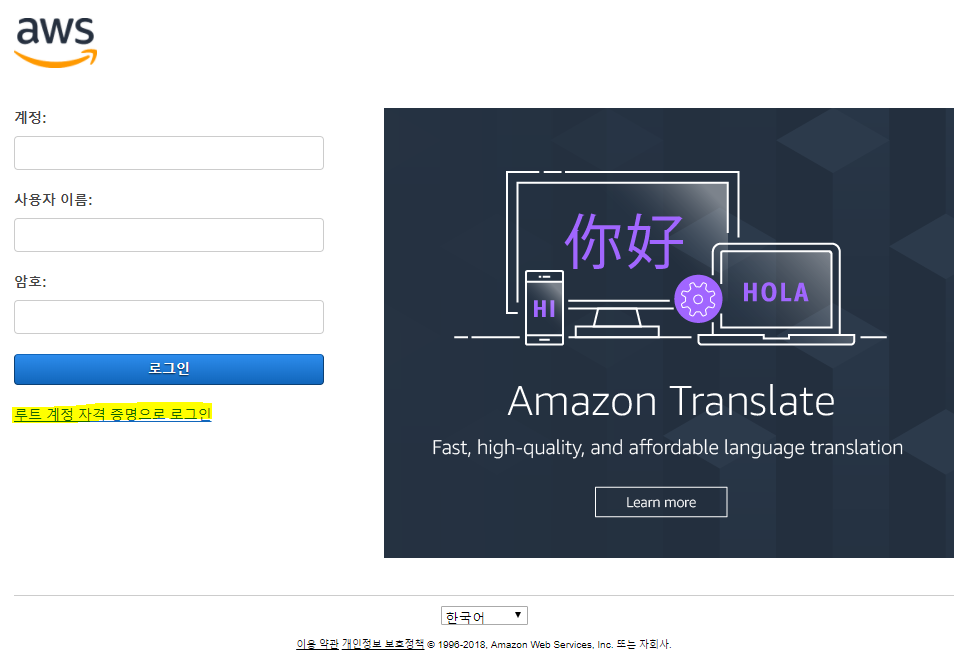
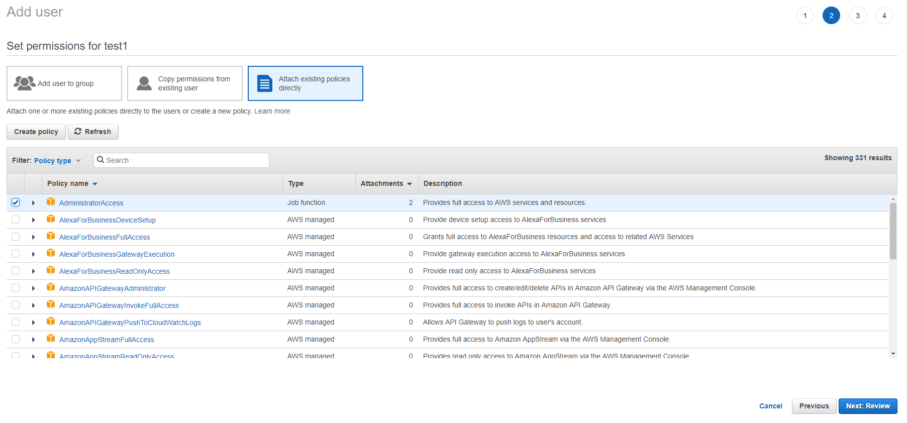

# AWS Web Console 로그인
AWS Root Account로 AWS Web Console에 로그인하여 IAM User를 만들고, Root Account에는 MFA를 적용하여 계정을 보안하는 방법에 대해 알아보자. IAM User에 Administrator Role이 들어가 있어야 하며, Root Account는 보안상 취약하니 되도록이면 AWS Web Console에 접근은 IAM User로 하도록 하자. IAM User가 있는 분들은 이 과정을 Skip해도 좋다.

## AWS Root Account 로그인
1. https://aws.amazonaws.com/ko/ 로 접속한다.

2. 오른쪽 상단에 **콘솔에 로그인**버튼을 클릭한다.

3. 로그인 화면이 뜨면 AWS 계정을 생성할 때 사용한 e-mail 주소를 입력한 후 **다음**버튼을 클릭한다.
    > [!메모]
    >
    > 아래와 같은 화면이 뜨는 사람이 있다. 이 화면은 IAM User로 로그인 하는 화면이며, 아랫쪽에 **루트 계정 자격 증명으로 로그인**을 클릭하여 Root Account로 로그인할 수 있는 화면으로 이동한다.
    > 

4. Root user sign in 화면이 뜨면 Password에 AWS 계정을 생성할 때 사용한 비밀 번호를 입력한다.

5. AWS Web Console에 로그인 되었는지 확인한다.

## AWS IAM User 생성
6. AWS Web Console에 로그인이 완료되면, 왼쪽 상단에 **Services**를 클릭하여 **Security, Identity & Compliance**영역에서 **IAM**을 찾아 클릭한다.

7. IAM Console에 접속이 되면 왼쪽 네비게이터에서 **Users**를 클릭한다.

8. IAM Web Console에 처음 접근한 사용자는 Users에 아무것도 없을 것이다. 왼쪽 상단에 **Add user**버튼을 클릭하여 IAM User를 생성하자.

9. Add user 화면이 뜨면 다음과 같이 항목을 선택한 후 오른쪽 하단에 **Next: Permissions**버튼을 클릭한다.
    - `User name`: 사용할 User 이름을 입력한다.
    - `Access type`: 생성한 User의 접근 형식을 선택한다. 여기서는 **AWS Management Console access**에 체크박스를 선택한다.
    - `Console password`: 생성할 User의 비밀번호를 생성한다. **Autogenerated password**를 선택하면 AWS에서 알아서 비밀번호를 생성해 준다. 이 값으로 진행하자.
    - `Require password reset`: 생성한 IAM User로 최초 로그인 시 비밀번호를 변경할 것인지 선택을 한다. 여기서는 **Users must create a new password at next sign-in**체크박스에 체크를 한다.

10. Set permissions for test 화면에서는 IAM User에 그룹 또는 정책을 설정하는 화면이다. 여기서는 **Attach existing policies directly**를 선택한다.

11. **Attach existing policies directly**를 선택하면 아랫쪽 화면이 바뀌는데, 여기에서 **AdministratorAccess**에 체크박스를 체크한 후 외른쪽 하단에 **Next: Review**버튼을 클릭한다.

12. Review 화면이 뜨면, 여태까지 설정한 설정들을 하나씩 확인해 본 후 오른쪽 하단에 **Create user**버튼을 클릭한다.

13. IAM User 생성이 완료되었다. 여기에서 Password 오른쪽에 **Show**를 눌러 비밀번호를 확인하거나 **Send email**을 눌러 e-mail로 계정정보를 보낼 수 있지만, 여기서는 가운데 표의 왼쪽 외에 있는 **Doenload .csv**버튼을 클릭하여 `credentials.csv`파일을 다운로드 한다.

14. 오른쪽 하단에 있는 **Close**버튼을 클릭하여 Add user를 종료한다.

## AWS Root Account에 MFA 설정
15. AWS Web Console 오른쪽 상단에 보면 종 모양 아이콘 오른쪽에 Root Account 계정의 이름을 확인할 수 있다. Root Account 계정의 이름을 클릭면 드롭 다운 메뉴가 나오는데, 그 항목중 **My Security Cerdentials**를 클릭한다.

16. 가운데 경고창이 뜨면 **Continuer to Security Credentials**버튼을 클릭하여 경고창을 없앤다.

17. Your Security Cerdentials의 항목 중 **Multi-factor authentication (MFA)**를 확장한 후 **Active MFA**버튼을 클릭하여 MFA 설정을 진행한다.

18. Manage MFA device 창이 뜨면 **A virtual MFA device**를 선택한 후 **Next Step**버튼을 클릭한다.

19. 다음 창은 안내화면이며, MFA 어플리케이션을 다운로드 하는 안내이다. 스마트폰에서 앱스토어 또는 구글플레이 등에 접속하여 **Google OTP** 또는 **Microsoft Authenticator**와 같은 OTP 앱을 설치한다. 앱 설치가 완료되면, 화면에서 **Next Step**버튼을 클릭한다.

20. 가운데 QR코드가 나오면 스마트폰에서 OTP 어플을 실행한 후 계정 추가를 선택하여 QR코드를 스캔한다. 스캔이 완료되면 OTP 앱에 6자리로 된 숫자가 보일 것이며 30초마다 코드가 갱신이 된다. 현재 코드 6자리를 **Authentication code 1**에 입력하고, 30초를 기다린 후 새롭게 발급된 코드 6자리를 **Authentication code 2**에 입력한다. 입력이 완료되었으면 **Active virtual MFA**버튼을 클릭하여 virtual OTP와 Sync를 맞춘다.
    > [!메모]
    >
    > 화면에 나온 QR코드는 꼭 캡쳐를 하여 별도로 저장을 하자. 나중에 핸드폰을 잃어버리면 AWS에 영어로 통화해야하는 불상사를 맛볼 수 있다. 캡쳐가 어렵다면, **Show secret key for manual configuration**를 확장하여 나오는 코드라도 복사해두자.

21. MFA 등록에 성공하면 **Finish**버튼을 클릭하여 과정을 완료한다.

## 생성한 AWS IAM User로 AWS Web Console 로그인
22. Root Account 계정에 보안설정이 완료되었다. 이제 특별한 일이 없다면, Root Account로 로그인을 할 일이 없으니 오른쪽 상단에 Root Account 계정의 이름을 클릭하여 **Sign out**을 클릭한다.

23. 앞서 IAM User를 만들 시 다운로드 받은 `credentials.csv`파일을 연다.

24. 파일을 열면 5개의 Column이 보이며, **Console login link**에 있는 URL을 복사하여 웹 브라우저 주소창에 복사한다.
    > [!메모]
    >
    > 주소 형식인 https://awsaccount.signin.aws.amazon.com/console 뒤에 ?region=ap-northeast-2 를 추가하면 서울 리전의 로그인창으로 접속한다. 이렇게 하면 조금 더 빠른 로그인 창을 볼 수 있으며, CloudTrail에도 ap-northeast-2에서 로그인했다는 정보가 입력된다. 기본 경로는 us-east-1으로 버지니아 리전에서 로그인처리를 한다.
    > https://awsaccount.signin.aws.amazon.com/console?region=ap-northeast-2

25. `credentials.csv`파일에 있는 **User name**과 **Password**를 각각 복사하여 붙여넣은 후 **로그인**버튼을 클릭한다.

26. 이전 IAM User를 생성할 때 설정한 것 처럼 최초 로그인시에 비밀 번호를 바꾸라는 창이 뜬다. 이전 비밀번호와 새 비밀번호, 개 비밀번호 재입력을 입력한 후 **비밀번호 변경 확인**버튼을 클릭한다.

27. IAM User로 로그인이 성공했다. IAM User로 로그인을 한 것을 확인하는 방법은 오른쪽 위에 종 모양 아이콘 오른쪽에 보면 `User name @ AWS계정번호`가 나오는 것을 확인할 수 있다.

## IAM User에 MFA 설정
28. IAM User에도 MFA설정을 할 수 있다. 특히 Administrator 권한 또는 리소스를 생성/삭제를 할 수 있는 IAM User는 MFA설정을 하지 않을 경우 과금폭탄을 맞을 가능성이 높다. AWS Web Console에서 IAM Console로 접근한다.

29. 왼쪽 네비게이터에서 **Users**를 클릭한다.

30. 앞서 생성한 IAM User를 클릭한다.

31. IAM User의 상세 정보로 들어오면 가운데 4개의 탭이 보일 것이다. 그 중 세번째 탭인 **Security cerdentials**를 클릭한다. **Security cerdentials**탭이 뜨면 **Sign-in credentials** 영역에 **Assigned MFA device**값이 `No`로 되어있는 것을 확인할 수 있다. 오른쪽에 연필 모양 아이콘을 클릭하여 수정하자.

32. Manage MFA device 창이 뜨면 **A virtual MFA device**를 선택한 후 **Next Step**버튼을 클릭한다.

33. 다음 창은 안내화면이며, MFA 어플리케이션을 다운로드 하는 안내이다. 이미 앞서 OTP 앱을 설치했기 때문에 과감하게 **Next Step**버튼을 클릭한다.

34. 가운데 QR코드가 나오면 스마트폰에서 OTP 어플을 실행한 후 계정 추가를 선택하여 QR코드를 스캔한다. 스캔이 완료되면 OTP 앱에 6자리로 된 숫자가 보일 것이며 30초마다 코드가 갱신이 된다. 현재 코드 6자리를 **Authentication code 1**에 입력하고, 30초를 기다린 후 새롭게 발급된 코드 6자리를 **Authentication code 2**에 입력한다. 입력이 완료되었으면 **Active virtual MFA**버튼을 클릭하여 virtual OTP와 Sync를 맞춘다.
    > [!메모]
    >
    > 앞서 언급한 것과 같이 QR코드 또는 **Show secret key for manual configuration**를 확장하여 나오는 코드를 백업해 두자.

35. MFA 등록에 성공하면 **Finish**버튼을 클릭하여 과정을 완료한다.

## IAM User의 AccessKey 생성
36. 앞으로 AWS Web Console이 아닌 AWS CLI 또는 AWS SDK를 이용하여 AWS API호출을 사용할 때가 있을 것이다. 그 때 사용하는 Key가 바로 `AccessKey`와 `Secret accesskey`이다. 보안상 이유로 `AccessKey`를 사용하는 것 보다는 `AWS IAM Role`을 이용하여 AWS Resource에 `AWS IAM Role`을 연결하여 사용하는 것을 권장하지만, AWS Resource가 아닌 곳에서는 `AccessKey`를 사용할 수 밖에 없다. 실습 과정 중에도 `AccessKey`를 사용할 예정이니 만들어 두자.

37. 앞서 IAM User의 MFA설정과 같은 탭에서 `AccessKey`를 발급받을 수 있다. IAM User의 상세 정보에서 세번째 탭인 **Security cerdentials**를 클릭한다. 오른쪽 스크롤을 내려보면 Access keys라는 영역이 보이고 바로 아래에 **Create access key**버튼이 보일 것이다. 바로 **Create access key**버튼을 클릭하자.

38. 별다른 내용 없이 AccessKey가 발급되며, **Access key ID**와 **Secret access key**를 바로 볼 수 있는 화면이 나오지만, 여기에서 우리는 **Download .csv file**버튼을 클릭하여 `accessKeys.csv`파일을 다운로드 받는다.
    > [!메모]
    >
    > Accesskey는 하나의 IAM User당 두개 까지 발급이 가능하다. 두개 이상 발급을 원한다면, IAM User를 추가로 생성하자.