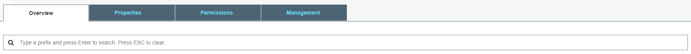

# CloudTrail 설정
AWS를 사용하다 보면 API call에 대하여 감사정책을 정의해야 할 때가 있다. 특히 금융권의 경우 법적으로 감사 로그를 저장해야 하는 의무기간도 있기 때문에 활성화는 필수이다. 기본적으로 CloudTrail은 90일간 API call에 대해 저장을 하지만, 자세히 저장하지 않고 90일 이상 저장을 하려면 CloudTrail 설정을 통해 S3 Bucket에 Log를 쌓아야 한다.

여기서는 CloudTrail을 활성화 하여 S3 Bucket에 저장하고, S3 Lifecycle을 이용하여 특정 주기에 맞게 데이터를 삭제하는 정책에 대해 알아본다. 

## CloudTrail 활성
1. [AWS Web Console](https://signin.aws.amazon.com/console)에 로그인한다.

2. 왼쪽 상단에 **Services**를 클릭하여 **Management Tools**영역에서 **CloudTrail**을 찾아 클릭한다.

3. Dashboard에 나오는 데이터가 최근 AWS Web Console에서 API를 호출한 이력이다. 왼쪽 네비게이터에서 **Event history**에는 CloudTrail Log가 약 90일간 저장되어 검색할 수 있는 도구이다. 우리는 CloudTrail을 활성화 할 예정이기 때문에 왼쪽 네비게이터에서 **Trails**를 클릭한다.

4. Trails 화면이 뜨면 **Create trail**버튼을 클릭하여 다음과 같이 정보를 입력한 후 하단에 **Create**버튼을 클릭한다.
    - `Trail name`: Cloudtrail의 이름을 입력한다.
    - `Apply trail to all regions`: CloudTrail이 AWS의 모든 Region에 대해 Log를 저장할 것인지 선택한다. 특별한 경우가 아니면 **Yes**를 선택하도록 하자.
    - `Read/Write events`: 어떤 Event를 CloudTrail Log로 저장할 것인지를 선택한다. 여기서는 **All**을 선택한다.
    - `Data events`: CloudTrail로 인해 생성되는 Data event는 S3와 Lambda로 보낼 수 있다. 여기서는 Logging이 목적이기 때문에 설정을 건드리지 않고 넘어간다.
    - `Create new S3 bucket`: CloudTrail Log를 쌓을 S3 bucket을 미리 만들었다면 **No**를, 그렇지 않다면 **Yes**를 클릭한다. **No**를 선택할 시 S3 Bucket에 CloudTrail이 접근 가능하도록 Policy 설정을 별도로 해주어야 한다. 여기서는 **Yes**를 선택하자.
    - `S3 bucket`: S3 bucket 이름을 입력한다. S3 bucket 이름은 전 세계에서 고유해야 한다. 여기서는 **<ID>.cloudtrail.log**라고 입력한다.

5. CloudTrail 설정이 완료되었다.    

## S3 bucket Lifecycle 설정
6. 위에서 설정한 CloudTrail의 Log는 지정한 S3 Bucket에 쌓이게 된다. 하지만, Log를 쌓기만 할 뿐 삭제는 별도로 해 주어야 하는 불편함이 있으며, 그대로 방치해 버리면 S3 Bucket 사용요금이 지속해서 증가 할 것이다. 따라서 내부 정책에 따라 CloudTrail 설정을 했을 시 S3 Bucket에 Lifecycle을 적용하여 특정 기간이 지나면 Log가 자동으로 삭제되도록 설정해야 한다.

7. 왼쪽 상단에 **Services**를 클릭하여 **Storage**영역에서 **S3**을 찾아 클릭한다.

8. CloudTrail 설정 시 생성한 S3 Bucket을 검색하여 클릭한다.

9. S3 Bucket의 세부정보가 나오면 상단에 **Management**탭을 클릭한다.

10. **Lifecycle**에서 **add lifecycle rule**버튼을 클릭하여 Lifecycle을 설정한다.

11. Lifecycle rule 화면의 Name and Scope가 뜨면 다음과 같이 입력한 후 **Next**버튼을 클릭한다.
    - `Enter a rule name`: Lifecycle rule 이름을 입력한다.
    - `Add filter to limit scope to prefix/tags`: Lifecycle rule이 적용 될 접두사와 tag를 지정한다. 여기서는 공란으로 두고 넘어가자.
    > [!메모]
    >
    > `Add filter to limit scope to prefix/tags`에서는 접미사를 설정할 수 없다.

12. Transitions는 Object의 유형을 변경하는 옵션이다. 우리는 특정 기간 후에 데이터를 **삭제**할 예정이니 **Next**버튼을 클릭하여 다음으로 넘어가자.

13. Expiration에서 다음과 같이 입력한 후 **Next**버튼을 클릭한다.
    - `Configure expiration`: **Current version** 체크박스에 체크한다. **Current version** 체크박스에 체크를 하면 하단에 **Expire current version of object**라는 항목이 나오며, 체크박스에 체크가 되어있는지 확인한 후 CloudTrail Log의 보관기간을 숫자로 입력한다. 여기서는 180을 입력하자.
    - `Clean up expired object delete markers and incomplete multipart uploads`: 기본 설정으로 둔다.

14. Review에서는 여태까지 설정한 Lifecycle rule에 대해 검토한 후 **Save**버튼을 클릭하여 Lifecycle rule을 저장한다.
    > [!메모]
    >
    > Lifecycle은 매일 00:00 (UTC)에 일괄적으로 동작한다. 한국 시간으로는 매일 09:00(KST)이며, 이 시각에 S3 object가 생성된지 180일이 지나야지만 Object가 삭제된다. 따라서 S3 object는 최대 181일간 저장될 수도 있다.