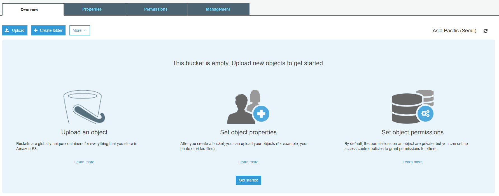
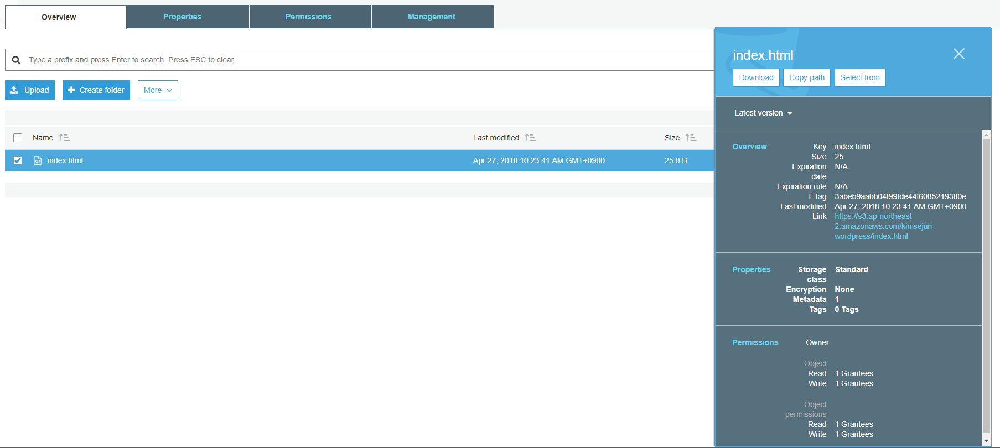
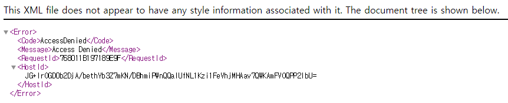
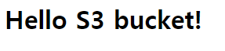
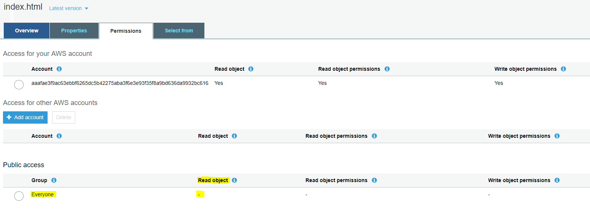
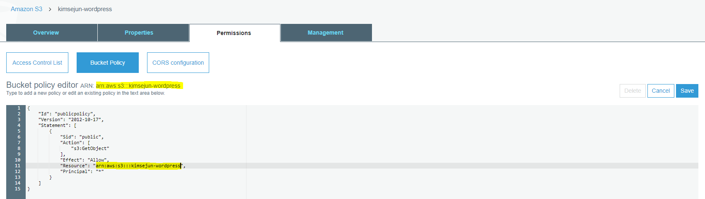

# S3 Bucket 생성
S3 bucket은 AWS Service 중 Top3에 속하는 서비스이다. AWS S3는 매우 편리하며, 데이터 저장에 대한 비용도 쌀 뿐만 아니라, 데이터를 외부에서 직접 접근할 수 있도록 URL도 제공해 줌으로써 Web Server가 필요 없는 환경을 만들어 준다.

여기서는 나중에 사용 할 S3 Bucket을 만들어 보고, S3 접근권한을 설정하는 방법을 살펴본다.

## S3 bucket 생성
1. [AWS Web Console](https://signin.aws.amazon.com/console)에 로그인한다.

2. 왼쪽 상단에 **Services**를 클릭하여 **Storage**영역에서 **S3**을 찾아 클릭한다.

3. S3 Console이 열리면 왼쪽 상단에 **Create bucket**버튼을 눌러 S3 bucket을 생성하자.

4. Create bucket 화면이 뜨고 Name and region이 뜨면 다음과 같이 입력한 후 **Next**버튼을 클릭한다.
    - `Bucket name`: Bucket 이름을 입력한다. 이 이름은 전 세계적으로 고유한 이름이어야 한다. 여기서는 `<자주사용하는 ID>-wordpress`로 입력 하자.
    - `Region`: Bucket이 생성될 Region을 지정한다. 여기서는 Asia Pacific (Seoul)을 선택한다.
    - `Copy settings from an existing bucket`: Bucket의 설정을 복제할 Source를 지정하는 옵션이다. 여기서는 기본값으로 둔다.

5. Set properties에서는 모두 기본 값으로 두고 **Next**버튼을 클릭한다.

6. Set permissions는 Bucket의 접근 권한을 설정하는 부분이다. 마찬가지로 모두 기본 값으로 두고 **Next**버튼을 클릭한다.

7. Review에서 여태까지 설정한 옵션을 확인한 후 **Create bucket**버튼을 클릭하여 S3 bucket을 생성한다.

## S3 permission과 ACL 설정
8. 생성된 Bucket은 기본적으로 AWS IAM에 접근 권한이 있는 모든 것들에 대하여 접근이 가능한 정책으로 설정된다. 따라서 외부에서는 그 어떤 접근도 전부 차단되며, IAM Policy에 의해 S3에 접근할 수 있는 권한이 있어야지만 방금 만든 `<자주사용하는 ID>-wordpress` Bucket에 읽기/쓰기가 가능하다. 여기서는 가볍게 특정 Object를 업로드 한 후 익명의 사용자가 접근을 하는 설정에 대해 알아보자. 우선 생성된 `<자주사용하는 ID>-wordpress` bucket을 클릭한다.
    > [!메모]
    >
    > S3 Bucket의 정책이 Public으로 설정을 하게 되면 누구든 접근이 가능한 Bucket이 되며, Object가 익명의 사용자에게 접근을 허용하게 된다. 이럴 경우 악의적인 행동으로 인해 의도치 않은 과다한 트래픽으로 인해 초과과금이 나올 수도 있다는 점을 생각해봐야 할 것이다.

9. bucket을 처음 생성하면 다음과 같은 화면을 확인할 수 있다.


10. 우선 index.html 파일을 가볍게 만들자. `notepad.exe`를 실행하여 다음과 같이 입력한 후 `index.html` 파일로 저장한다.
    ```html
    <H1>Hello S3 bucket!</H1>
    ```
    > [!메모]
    >
    > `index.html`을 저장할 때 **파일 형식**을 `모든 파일 (*.*)`로 변경하여 저장해야한다. 그렇지 않으면 파일의 확장자가 .txt가 될 것이다.

10. 파일 작성이 완료되면, 왼쪽 상단에 **Upload**를 클릭하여 파일을 업로드 하자.

11. Upload 화면이 뜨고 Select files가 뜨면 가운데에 **Add files**를 클릭하여 방금 생성한 `index.html`을 선택하여 열고, **Next**버튼을 클릭한다.

12. Set properties에서는 모두 기본 값으로 두고 **Next**버튼을 클릭한다.

13. Set permissions는 업로드하는 Object의 접근 권한을 설정하는 부분이다. 마찬가지로 모두 기본 값으로 두고 **Next**버튼을 클릭한다.

14. Review에서 여태까지 설정한 옵션을 확인한 후 **Upload**버튼을 클릭하여 Object를 업로드한다.

15. 다음 화면과 같이 업로드된 `index.html` Object를 클릭하면 오른쪽에 `index.html`의 간략한 내용이 나온다. **Overview**를 클릭하여 조금 더 상세한 페이지로 이동한다.


16. `index.html` Object의 Overview 아래쪽에 **Link**의 URL을 복사하여 새로운 웹 브라우저에 붙여넣어 접근해 보자. 그럼 다음과 같은 화면과 같이 `AccessDenied`를 볼 수 있다.


17. 새로운 웹 브라우저는 닫고 다시 S3 web console로 돌아온다. `index.html` Object의 Overview화면에 보면 네 개의 탭을 볼 수 있으며, 세 번째 **Permissions**탭을 클릭하여 이동한다.

18. **Permissions**탭을 보면 아래쪽에 **Public access**이 있고, Everyone을 클릭하면 오른쪽에 새로운 창이 뜬다. **Access to the object**영역에 있는 **Read object**의 체크박스에 체크를 한 후 아랫쪽에 **Save**버튼을 클릭하여 저장한다.
    > ![메모]
    >
    > Access to the object 영역의 **Read object**와 Access to this object's ACL 영역의 **Read object permissions**는 동일한 설정이다. ACL로 설정하느냐? Policy로 설정하느냐? 의 차이이며, 실제 동작은 같다고 보면 된다.

19. 다시 **Overview**화면으로 돌아와아래쪽에 **Link**의 URL을 복사하여 새로운 웹 브라우저에 붙여넣어 접근한다. 다음과 같이 정상적인 페이지가 뜨면 정상이다.


20. 위에서 설정한 **permission**을 원상복귀 시킨다. **permission**탭에서 **Public access** 설정을 풀고 저장한다. 설정이 완료되면 다음과 같이 **Read object**의 갑싱 `-`이어야 한다.


21. 상단에 Amazon S3 > `<자주사용하는 ID>-wordpress` 부분을 클릭하여 `<자주사용하는 ID>-wordpress` 화면으로 돌아온다.

22. 여기도 마찬가지로 4개의 탭이 보이는데, **Permissions**탭을 클릭하여 이동한다.

23. 상단에 Bucket policy을 클릭하면 다음 화면과 같은 창이 뜰 것이다. 여기에 다음과 같이 입력한 후 오른쪽 위에 **Save**버튼을 클릭한다.
    ```s3 policy
    {
        "Id": "publicpolicy",
        "Version": "2012-10-17",
        "Statement": [
            {
                "Sid": "public",
                "Action": [
                    "s3:GetObject"
                ],
                "Effect": "Allow",
                "Resource": "arn:aws:s3:::<YOUR-BUCKET-NAME>/*",
                "Principal": "*"
            }
        ]
    }
    ```
    

    > [!메모]
    >
    > S3, IAM 등 AWS Policy를 생성해주는 [AWS Policy Generator](https://awspolicygen.s3.amazonaws.com/policygen.html) 페이지가 있다. 나중에 활용할 수 있도록 저장해 두자.

    > [!메모]
    >
    > S3 Policy는 Bucket 권한과 Object 권한이 별도로 존재한다. 위와 같이 Object에 권한을 부여하려면 `/*` 또는 `/index.html`, `/image/*`과 같이 Object를 지정해 주어야 한다.

24. 위와 같이 저장을 하면 촌스러운 주황색으로 **Public**이라는 문구를 볼 수 있다. 이는 위에서 언급한 것 처럼 이 Bucket의 Objects는 익명의 사용자가 접근이 가능하다는 뜻이다. `index.html` object URL을 복사하여 새로운 브라우저에 열어보자.

25. 확인이 되었다면 S3 bucket의 **Permissions**설정을 원래대로 돌려놓자. Bucket의 **Permissions** 탭에서 오른쪽에 **Delete**버튼을 클릭하여 정책을 지운다.