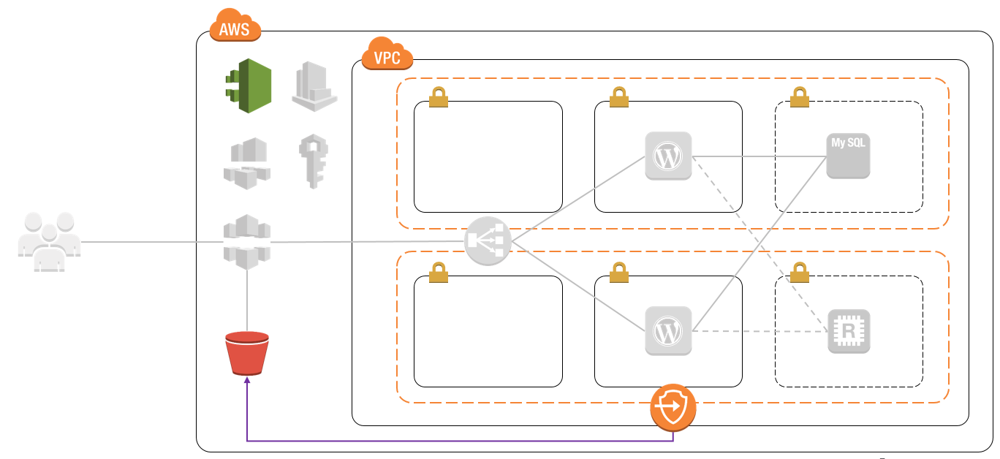

# VPC와 Subnet 만들기
AWS에서 EC2를 사용하려면 기본적으로 VPC라는 가상 네트워크를 만들어야 한다. 기본적으로 Default VPC라는 것이 존재하지만, 나중에 VPN이나 Private Subnet, Route table 설정 등 추가 설정을 하기 어렵기 때문에, 미리 네트워크를 정의하고, 그에 맞게 VPC를 만드는 것이 좋다.

앞서 슬라이드에서 본 것 처럼 우리는 6개의 하나의 VPC 안에 Subnet을 생성하고, 4개는 Public Subnet으로, 2개는 Private Subnet으로 생성할 것이다. 또한 VPC Endpoint를 이용하여 S3 Bucket에 접근할 수 있는 설정 또한 만들 것이다. 그림으로 보면 다음과 같다.

다음을 하나씩 따라하면서 VPC를 생성해 보자.

## VPC 생성
1. [AWS Web Console](https://signin.aws.amazon.com/console)에 로그인한다.

2. 왼쪽 상단에 **Services**를 클릭하여 **Networking & Content Delivery**영역에서 **VPC**을 찾아 클릭한다.

3. 왼쪽 네비게이터에서 **Your VPCs**를 클릭하고, 상단에 **Create VPC**를 클릭하여 다음과 같이 입력한 후 **Yes, Create**버튼을 클릭한다.
    - `Name tag`: VPC의 이름을 입력한다.
    - `IPv4 CIDR block`: IPv4의 CIDR값을 입력한다. 여기서는 **10.0.0.0/16**을 입력하자.
    - `IPv6 CIDR block`: IPv6를 사용할지 선택한다. 여기서는 **No IPv6 CIDR block**을 선택하자.
    - `Tenancy`: VPC의 형식을 선택한다. **Default**는 기본적인 VPC를 이야기 하며, **Dedicated**는 Dedicated EC2, Dedicated Host에서 사용하는 VPC이다. 여기서는 **Default**를 선택한다.

4. VPC가 생성이 완료되었으면, 생성된 VPC를 클릭하여 정보를 확인하자.

5. 생성된 VPC를 선택하고 마우스 우클릭 또는 상단에 **Actions**를 선택한 후 **Edit DNS Resolution**을 클릭한다.

6. Edit DNS Resolution 창이 뜨면 `DNS Resolution`옵션을 **Yes**로 선택한 후 **Save**버튼을 클릭한다. 이 설정은 IP를 DNS로 변경할 수 있도록 설정하는 옵션이다.

7. 마찬가지 방법으로 우클릭 또는 상단에 **Actions**를 선택한 후 **Edit DNS Hostnames**를 클릭한다.

8. Edit DNS Hostnames 창이 뜨면 `DNS Hostnames`옵션을 **Yes**로 선택한 후 **Save**버튼을 클릭한다. 이 설정은 DNS Hostname을 설정할 수 있도록 하는 옵션이다.

## Subnets 생성
9. 왼쪽 네비게이터에서 **Subnets**를 클릭한다.

10. 우리는 총 6개의 Subnets를 생성할 것이다. 상단에 **Create Subnet**을 클릭하여 다음과 같이 입력한 후 **Yes, Create**버튼을 클릭하는 작업을 6번 반복한다.
    - `Name tag`: Subnet 이름을 입력한다. 여기서는 **<VPC이름>-Public-ELB-2a**라고 입력한다.
    - `VPC`: 위에서 만든 VPC를 선택한다.
    - `VPC CIDRs`: VPC를 선택하면 자동으로 설정된다. 이 옵션은 VPC에 CIDRs를 여러개 생성하였을 시 도움을 준다.
    - `Availability Zone`: Subnet을 생성할 AZ를 선택한다. 여기서는 **ap-northeast-2a**를 선택한다.
    - `IPv4 CIDR block`: Subnet의 CIDR값을 입력한다. Subnet의 CIDR값은 VPC CIDR안에 포함되어야 한다. 여기서는 **10.0.0.0/24**를 입력한다.
      

    - `Name tag`: Subnet 이름을 입력한다. 여기서는 **<VPC이름>-Public-ELB-2c**라고 입력한다.
    - `VPC`: 위에서 만든 VPC를 선택한다.
    - `VPC CIDRs`: VPC를 선택하면 자동으로 설정된다.
    - `Availability Zone`: Subnet을 생성할 AZ를 선택한다. 여기서는 **ap-northeast-2c**를 선택한다.
    - `IPv4 CIDR block`: Subnet의 CIDR값을 입력한다. 여기서는 **10.0.1.0/24**를 입력한다.
      

    - `Name tag`: Subnet 이름을 입력한다. 여기서는 **<VPC이름>-Public-EC2-2a**라고 입력한다.
    - `VPC`: 위에서 만든 VPC를 선택한다.
    - `VPC CIDRs`: VPC를 선택하면 자동으로 설정된다.
    - `Availability Zone`: Subnet을 생성할 AZ를 선택한다. 여기서는 **ap-northeast-2a**를 선택한다.
    - `IPv4 CIDR block`: Subnet의 CIDR값을 입력한다. 여기서는 **10.0.2.0/24**를 입력한다.
      

    - `Name tag`: Subnet 이름을 입력한다. 여기서는 **<VPC이름>-Public-EC2-2c**라고 입력한다.
    - `VPC`: 위에서 만든 VPC를 선택한다.
    - `VPC CIDRs`: VPC를 선택하면 자동으로 설정된다.
    - `Availability Zone`: Subnet을 생성할 AZ를 선택한다. 여기서는 **ap-northeast-2c**를 선택한다.
    - `IPv4 CIDR block`: Subnet의 CIDR값을 입력한다. 여기서는 **10.0.3.0/24**를 입력한다.
      

    - `Name tag`: Subnet 이름을 입력한다. 여기서는 **<VPC이름>-Private-RDB-2a**라고 입력한다.
    - `VPC`: 위에서 만든 VPC를 선택한다.
    - `VPC CIDRs`: VPC를 선택하면 자동으로 설정된다.
    - `Availability Zone`: Subnet을 생성할 AZ를 선택한다. 여기서는 **ap-northeast-2a**를 선택한다.
    - `IPv4 CIDR block`: Subnet의 CIDR값을 입력한다. 여기서는 **10.0.4.0/24**를 입력한다.
      

    - `Name tag`: Subnet 이름을 입력한다. 여기서는 **<VPC이름>-Private-RDB-2c**라고 입력한다.
    - `VPC`: 위에서 만든 VPC를 선택한다.
    - `VPC CIDRs`: VPC를 선택하면 자동으로 설정된다.
    - `Availability Zone`: Subnet을 생성할 AZ를 선택한다. 여기서는 **ap-northeast-2c**를 선택한다.
    - `IPv4 CIDR block`: Subnet의 CIDR값을 입력한다. 여기서는 **10.0.5.0/24**를 입력한다.
      

    > [!메모]
    >
    > Subnet을 생성한 후 마우스 우클릭 또는 상단에 **Subnet Actions**버튼을 클릭한 후 **Modify auto-accign IP settings**를 클릭하면, 해당 Subnet에 생성되는 EC2에 자동으로 동적 공인IP를 연결할 것인지 물어보는 창이 뜬다. 이 설정을 하게 되면 해당 Subnet에 EC2를 생성할 때 기본적으로 동적 공인 IP가 할당되도록 설정할 수 있다.

## Route Tables 생성과 Subnets 연결
11. 왼쪽 네비게이터에서 **Route Tables**를 클릭한다. 화면이 바뀌면 이미 생성된 Route Tables가 있을 것이다. 우리는 용도에 맞게 새로운 Route Tables를 생성하여 설정해 보자

12. 우리는 총 3개의 Route Tables를 생성할 것이다. 상단에 **Create Route Table**을 클릭하여 다음과 같이 입력한 후 **Yes, Create**버튼을 클릭하는 작업을 3번 반복한다.
    - `Name tag`: Route Tables의 이름을 입력한다. 여기서는 **<VPC이름>-ELB-RT**라고 입력한다.
    - `VPC`: 앞서 생성한 VPC를 선택한다.
      

    - `Name tag`: Route Tables의 이름을 입력한다. 여기서는 **<VPC이름>-EC2-RT**라고 입력한다.
    - `VPC`: 앞서 생성한 VPC를 선택한다.
      

    - `Name tag`: Route Tables의 이름을 입력한다. 여기서는 **<VPC이름>-RDB-RT**라고 입력한다.
    - `VPC`: 앞서 생성한 VPC를 선택한다.
      

13. 생성한 Route Table에 Subnets를 연결해 보자. 다음과 같이 Route Table을 선택한 후 **Subnet Associations**탭에서 **Edit**버튼을 클릭한 후 명시된 Subnets를 선택 후 **Save**버튼을 클릭한다.
    - `<VPC이름>-ELB-RT`: **<VPC이름>-Public-ELB-2a (10.0.0.0/24)**와 **<VPC이름>-Public-ELB-2c (10.0.1.0/24)**를 연결
    - `<VPC이름>-EC2-RT`: **<VPC이름>-Public-EC2-2a (10.0.2.0/24)**와 **<VPC이름>-Public-EC2-2c (10.0.3.0/24)**를 연결
    - `<VPC이름>-RDB-RT`: **<VPC이름>-Private-RDB-2a (10.0.4.0/24)**와 **<VPC이름>-Private-RDB-2c (10.0.5.0/24)**를 연결

## Internet Gateway 생성과 VPC 연결, Public Subnet 설정을 위한 Route Table 수정
14. 왼쪽 네비게이터에서 **Internet Gateways**를 클릭한다. 상단에 **Create internet gateway**버튼을 클릭하고 아래와 같이 입력한 후에 **Create**버튼을 클릭한다.
    - `Name tag`: Internet gateway 이름을 입력한다. 여기서는 **<VPC이름>-IGW**라고 입력한다.

15. Internet gateway가 만들어지면, State에 Detached라고 표시가 되는 것을 확인할 수 있다. 생성된 Internet Gateway를 선택하고 마우스 우클릭 또는 상단에 **Actions**버튼을 클릭한 후 **Attach to VPC**를 클릭한다.

16. 다음과 같이 설정한 후 **Attach**버튼을 클릭한다.
    - `VPC`: 위에서 생성한 VPC를 선택한다. Internet Gateway가 연결되지 않은 VPC만 선택할 수 있다.

17. Internet Gateway 연결이 끝났으면, 이제 Public Subnet에 연결된 Route Table을 수정하자. 왼쪽 네비게이터에서 **Route Tables**를 클릭한다.

18. 앞서 만든 `<VPC이름>-ELB-RT`를 선택한다.

19. 하단에 **Routes**탭으로 이동한 후 **Edit**버튼을 클릭한다.

20. 하단에 **Add another route**버튼을 클릭하여 한 줄을 새롭게 만든 후 다음과 같이 입력한 후 상단에 **Save**버튼을 클릭한다.
    - `Destination`: Route Table에 의해 다음 홉으로 이동할 CIDR Block을 선언한다. 모든 요청을 Internet Gateway로 보낼 것이기 때문에 **0.0.0.0/0**을 입력한다.
    - `Target`: 다음 홉으로 이어지는 대상을 선택한다. 앞서 생성한 Internet gateway를 선택한다.

21. 19-20에서 설명한 것과 마찬가지 방법으로 `<VPC이름>-EC2-RT`의 Routes 설정도 수정한다.

## S3와 사설 통신을 위한 VPC Endpoints 설정
22. S3의 Endpoint는 Public에 있다. 이 말은 다른말로 하면 S3에 접근하려면 Internet이 되어야 한다는 의미이다. 더 쉽게 이야기 하자면, EC2가 S3와 통신하려면 Internet이 되어야 한다는 의미이다. 하지만 많은 사용자들이 S3에 컨텐츠를 저장하기 때문에 사설 통신을 하고 싶어 한다. 이를 지원하려면 VPC에 Endpoint를 만들어 S3와 연결해 주는 방법이 있다. 왼쪽 네비게이터에서 **endpoints**를 클릭한다.

23. 상단에 **Create Endpoint**를 클릭한다.

24. 다음과 같이 입력한 후 하단에 **Create endpoint**버튼을 클릭한다.
    - `Service category`: 서비스를 제공하는 주체를 선택한다. S3 Endpoint는 AWS에서 제공하기 때문에 **AWS services**를 선택한다.
    - `Service Name`: AWS에서 제공하는 서비스 이름을 선택한다. 여기서는 **com.amazonaws.ap-northeast-1.s3**을 선택한다.
    - `VPC`: 앞서 생성한 VPC를 선택한다.
    - `Configure route tables`: Endpoint를 연결할 Route Tables를 선택한다. 앞서 생성한 `<VPC이름>-EC2-RT`의 Route table ID를 선택한다. 잘 모르겠으면 **Route Tables**에서 ID를 확인하거나, **Associated With**에 `n subnets`에 마우스를 올리면 연결된 Subnets를 확인할 수 있다.
    - `Policy`: Endpoint의 접근 정책을 설정한다. 여기서는 기본 값인 **Full Access**를 선택한다.