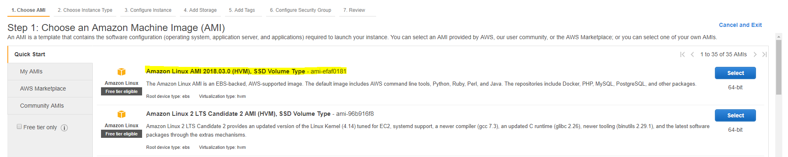
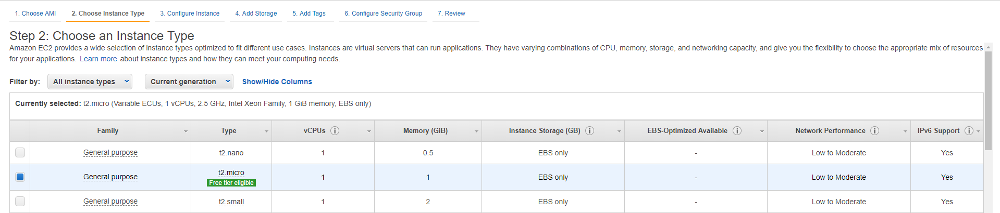
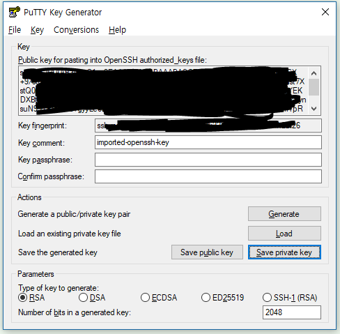

# EC2에 Wordpress 설치
AWS에서 가장 많은 이용자가 사용하는 EC2를 생성하여 Wordpress를 설치해 보자. 여기서부터는 자칫 잘못하면 과금이 발생할 수 있으니 주의하도록 하자. EC2는 가상 컴퓨터로 우리가 사용하는 컴퓨터와 똑같다. 다른점이 있다면, 물리적인 장비가 아닌 논리적인 장비라는 점이다.

여기서는 EC2를 생성하고, 접근하여 Wordpress를 설치하는 단계까지 진행해 본다. 시간 단축을 위해 Wordpress는 직접 설치하지 않고 Script를 통해 EC2가 생성될 때 최초 1회 실행되는 **User data**라는 것을 이용하여 생성한다.

## User data로 wordpress를 설치하는 EC2 생성
1. [AWS Web Console](https://signin.aws.amazon.com/console)에 로그인한다.

2. 왼쪽 상단에 **Services**를 클릭하여 **Compute**영역에서 **EC2**를 찾아 클릭한다.

3. 왼쪽 네비게이터에서 **Instances**를 클릭하고, 상단에 **Launch Instance**를 클릭하여 EC2 Instance를 생성한다.

4. **Step 1: Choose an Amazon Machine Image (AMI)**화면이 뜨면 **Amazon Linux AMI**로 시작하는 가장 위의 항목의 **Select**를 클릭한다.


5. **Step 2: Choose an Instance Type**화면이 뜨면 Type이 t2.micro로 되어있는 항목을 선택한 후 하단에 **Next: Configure Instance Details**버튼을 클릭한다.


6. **Step 3: Configure Instance Details**화면이 뜨면 아래와 같이 내용을 입력한 후 **Next: Add Storage**버튼을 클릭한다.
    - `Number of instances`: 생성할 Instance 개수를 선택한다. 기본 값인 1을 사용한다.
    - `Purchasing option`: Spot Instance를 사용할지 선택하는 옵션이다. Spot Instance는 무료가 아니니 체크박스에 체크를 하지 않는다.
    - `Network`: EC2를 생성할 VPC를 선택한다. 이전에 생성한 VPC를 선택한다.
    - `Subnet`: EC2를 생성할 Subnet을 선택한다. 여기서는 **<VPC이름>-Public-EC2-2a**를 선택한다.
    - `Auto-assign Public IP`: 자동으로 공인 IP를 연결할 것인지 선택한다. 이 옵션을 Enable로 선택하면, EC2에 동적 공인 IP가 설정된다. 여기서는 **Enable**을 선택한다.
    - `IAM role`: EC2에 연결할 IAM Role을 선택한다. 나중에 수정이 가능하니 **None**을 선택한다.
    - `Shutdown behavior`: EC2의 OS에서 Instance를 중지할 시 처리하는 옵션을 선택한다. 기본 값인 **Stop**을 선택한다.
    - `Enable termination protection`: EC2를 종료(삭제)하지 못하도록 보호하는 옵션이다. 여기서는 체크박스에 체크를 하지 않는다.
    - `Monitoring`: EC2의 모니터링을 초단위까지 할 수 있는 옵션이다. 과금이니 여기서는 체크박스에 체크를 하지 않는다.
    - `Tenancy`: EC2를 어디에 생성할지를 선택한다. Dedicated EC2나 Dedicated Host를 이용할 시 사용하는 옵션이며, 여기서는 기본 값인 **Shared**를 선택한다.
    - `T2 Unlimited`: T2 type은 CPU Credit을 저장하여 Busting할 수 있다. 이 크래딧을 전부 소모를 하면 성능 저하가 일어나는데, 이 옵션을 켜면 성능 저하를 돈으로 떼울 수 있다. 여기에선 체크박스에 체크를 하지 않는다.
    - `Network interfaces`: 네트워크 인터페이스 설정이다. 기본 값을 그대로 놔둔다.
    - `Advanced Details`: User data를 설정할 수 있는 옵션이다. 클릭하여 옵션을 확장하자.
        - `User data`: **AS text**를 선택한 후 아래 bash script를 붙여넣는다.
        ```script
        #!/bin/bash

        yum update -y
        yum install -y httpd24 php70 php70-mysqlnd
        chkconfig httpd on

        cd /tmp
        curl -O https://wordpress.org/latest.tar.gz
        tar xzvf latest.tar.gz
        touch /tmp/wordpress/.htaccess
        chmod 660 /tmp/wordpress/.htaccess
        cp /tmp/wordpress/wp-config-sample.php /tmp/wordpress/wp-config.php
        mkdir /tmp/wordpress/wp-content/upgrade

        sed -i -e '83a\\' /tmp/wordpress/wp-config.php
        sed -i -e '84a\\define("FS_METHOD", "direct");' /tmp/wordpress/wp-config.php
        sed -i -e '85a\\define("WP_HOME", "http://". filter_input(INPUT_SERVER, "HTTP_HOST", FILTER_SANITIZE_STRING));' /tmp/wordpress/wp-config.php
        sed -i -e '86a\\define("WP_SITEURL", "http://". filter_input(INPUT_SERVER, "HTTP_HOST", FILTER_SANITIZE_STRING));' /tmp/wordpress/wp-config.php
        sed -i -e '87a\\define("WP_CONTENT_URL", "/wp-content");' /tmp/wordpress/wp-config.php
        sed -i -e '88a\\define("DOMAIN_CURRENT_SITE", filter_input(INPUT_SERVER, "HTTP_HOST", FILTER_SANITIZE_STRING));' /tmp/wordpress/wp-config.php
        sed -i -e '89a\\' /tmp/wordpress/wp-config.php
        sed -i -e '90a\\' /tmp/wordpress/wp-config.php

        rm -rf /var/www/html
        sudo cp -a /tmp/wordpress/. /var/www/html

        usermod -a -G apache ec2-user
        chown -R ec2-user:apache /var/www
        chmod 2775 /var/www
        find /var/www -type d -exec sudo chmod 2775 {} \;
        find /var/www -type f -exec sudo chmod 0664 {} \;
        service httpd start
        ```

        > [!메모]
        >
        > 위 스크립트 파일은 [/Source/wordpress_init.sh](./../Source/wordpress_init.sh) 위치에 있다.

7. **Step 4: Add Storage**화면이 뜨면 모든 값을 기본 값으로 두고 **Next: Add Tags**버튼을 클릭한다.

8. **Step 5: Add Tags**화면이 뜨면 가운데 **Add Tag**버튼을 클릭한 후 다음과 같이 입력하고 **Next: Configure Security Group**버튼을 클릭한다.
    - `Key`: Tag Key를 입력한다. 여기서는 **Name**으로 입력한다.
    - `Value`: Tag Value를 입력한다. 여기서는 **Wordpress**로 입력한다.
    - `Instances`: Instance에 Tag를 설정할 것인지 선택한다. 기본 값으로 둔다.
    - `Volumes`: 같이 생성 될 EBS(volume Disk)에 Tag를 설정할 것인지 선택한다. 기본 값으로 둔다.

9. **Step 6: Configure Security Group**화면이 뜨면 다음과 같이 입력한 후 **Review and Launch**버튼을 클릭한다.
    - `Assign a security group`: Security Group을 만들지, 만들어진 것을 선택할 지를 선택한다. 여기서는 **Create a new security group**을 선택한다.
    - `Security group name`: Security Group 이름을 입력한다. 여기서는 **wordpress-sg**라고 입력한다.
    - `Description`: Security Group의 설명을 입력한다. `Security group name`과 동일하게 입력한다.
    - `Rule`: 두 개의 Rule을 설정 할 것이다 **Add Rule**버튼을 클릭하여 다음과 같이 두 가지 내용을 입력한다.
        - `Type`: 미리 정의된 Rule의 유형을 선택한다. 여기서는 **SSH**를 선택한다.
        - `Protocol`: Security Group의 Protocol을 선택한다. `Type`을 **SSH**로 선택하면 자동으로 입력된다.
        - `Port Range`: Security Group의 Port 범위를 선택한다. `Type`을 **SSH**로 선택하면 자동으로 입력된다.
        - `source`: EC2에 접근할 수 있는 IP CIDR값을 입력한다. 보안을 위해 **custom**을 클릭하여 드롭 다운메뉴를 펼친 다음 **My IP**를 선택한다.
        - `Description`: Rule의 설명을 입력한다. 여기서는 **SSH**라고 입력한다.
        <br/><br/>

        - `Type`: 미리 정의된 Rule의 유형을 선택한다. 여기서는 **HTTP**를 선택한다.
        - `Protocol`: Security Group의 Protocol을 선택한다. `Type`을 **HTTP**로 선택하면 자동으로 입력된다.
        - `Port Range`: Security Group의 Port 범위를 선택한다. `Type`을 **HTTP**로 선택하면 자동으로 입력된다.
        - `source`: EC2에 접근할 수 있는 IP CIDR값을 입력한다. 여기서는 **custom**을 클릭하여 드롭 다운메뉴를 펼친 다음 **Anywarer**을 선택한다.
        - `Description`: Rule의 설명을 입력한다. 여기서는 **HTTP**라고 입력한다.

10. **Step 7: Review Instance Launch**화면에서 최종적으로 설정을 확인한 다음 하단에 **Launch**버튼을 클릭한다.

11. **Launch**버튼을 클릭하면 **Select an existing key pair or create a new key pair**창이 뜬다. **Create a new key pair**를 선택한 후 **Key pair name**에 자주 쓰는 ID값을 입력한 후 **Download Key Pair**버튼을 눌러 Key pair를 다운로드 받는다. 다운로드가 완료되면 하단에 **Launch Instances**버튼을 클릭한다.
    > [!메모]
    >
    > Key pair가 이미 있는 사용자들은 Choose an existing key pair를 선택하고 자신이 가지고 있는 Key pair를 선택한 후 Instance를 Launch하자

12. Linux, OS X 또는 Windows 10에서 Bash shell을 설치하지 않았다면, Putty라는 프로그램으로 SSH접속을 해야 할 것이다. putty를 사용하려면 다운로드 받은 .pem파일이 아닌 .ppk파일이 필요한데, 파일 변환을 해야 한다. 우선 [Putty 다운로드 페이지](https://www.chiark.greenend.org.uk/~sgtatham/putty/latest.html)에서 `putty.exe`와 `puttygen.exe`를 다운로드 받는다.

13. 다운로드 받은 `puttygen.exe`를 실행한다.

14. `puttygen.exe`창이 뜨면, 상단 메뉴에 **Conversions**에서 **Import key**를 클릭하고, 위에서 다운로드 된 .pem파일을 찾아 연다.

15. 파일을 열면 다음과 같이 파일이 로딩되며, **Actions**영역에 **Save private key** 버튼을 눌러 .ppk 파일로 저장한다.
