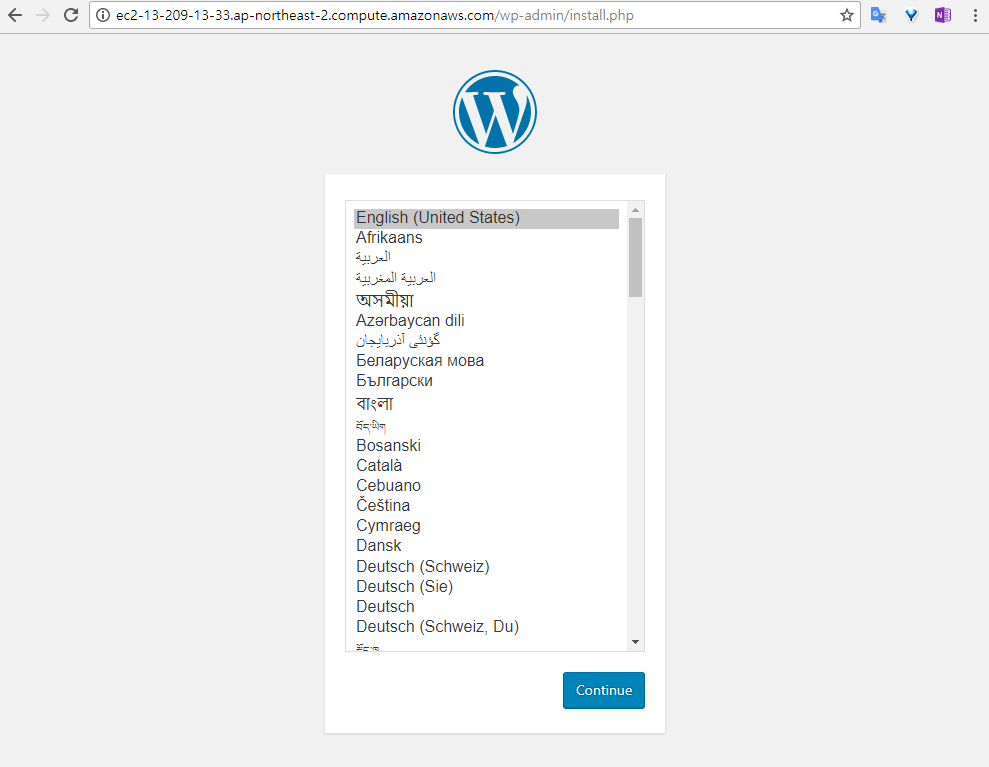

# RDS 생성 후 Wordpress 연결
RDS는 AWS 관리형 데이터베이스이다. RDS를 사용하는 이유는 관리의 자동화에 있다. 성능적인 이득을 보기 위해서는 RDS보다는 설치형 데이터베이스를 쓰는 것이 훨신 낫다. 하지만 RDS Aurora는 많은 추가기능들이 있어 사용하기에 편리한 기능들을 제공한다. MySQL과 PostgraeSQL을 기반으로 수정보안하여 Oracle이나 SQL Server과 비교할 수 있는 기능들이 추가되고 있으며, Multi-Master와 Aurora Serverless와 같은 기능들을 준비하고 있다.

여기서는 RDS를 생성하여 데이터베이스를 별도로 관리하는 시나리오를 Wordpress로 구현하는 방법에 대해 알아본다. 많은 시나리오가 있지만 굳이 Wordpress로 진행하는 이유는 그만큼 쉽고 간편하게 설명할 수 있기 때문이다.

## RDS 생성 전 준비
1. [AWS Web Console](https://signin.aws.amazon.com/console)에 로그인한다.

2. 왼쪽 상단에 **Services**를 클릭하여 **Compute**영역에서 **EC2**를 찾아 클릭한다.

3. 왼쪽 네비게이터에서 **Security Groups**를 클릭한다.

4. 왼쪽 상단에 **Create Security Group**버튼을 클릭한다.

5. **Create Subnet Group**창이 뜨면 다음과 같이 입력한 후 **Create**버튼을 클릭한다.
    - `Security group name`: Security Group 이름을 입력한다. 여기서는 **wordpressdb-sg**라고 입력한다.
    - `Description`: Security Group의 설명을 입력한다. 여기서는 **wordpressdb-sg**라고 입력한다.
    - `VPC`: Security Group을 생성할 VPC를 선택한다. 이전에 생성한 VPC를 선택한다.
    - `Inbound`: Inbound 정책을 추가한다. **Add Rule** 버튼을 클리하여 다음 정책을 추가하자.
        - `Type`: 미리 정의된 Rule의 유형을 선택한다. 여기서는 **MYSQL/Aurora**를 선택한다.
        - `Protocol`: Security Group의 Protocol을 선택한다. `Type`을 **MYSQL/Aurora**로 선택하면 자동으로 입력된다.
        - `Port Range`: Security Group의 Port 범위를 선택한다. `Type`을 **MYSQL/Aurora**로 선택하면 자동으로 입력된다.
        - `source`: EC2에 접근할 수 있는 IP CIDR값을 입력해야 하지만, Security Group ID도 입력할 수 있다. 여기서는 **wordpress-sg**을 입력하여 나타난 Security Group ID를 선택한다.
        - `Description`: Rule의 설명을 입력한다. 여기서는 **wordpresstomysql**이라고 입력한다.

6. 왼쪽 상단에 **Services**를 클릭하여 **Datadbase**영역에서 **RDS**를 찾아 클릭한다.

7. RDS를 생성하기 전에 우선 설정해야 할 것들이 있다. RDS를 생성할 때 Subnet을 직접 지정하지 않고, Subnet Group을 지정하도록 되어 있는데, 이는 RDS가 어느 Subnet을 사용할 것인지에 대한 정의를 하는 옵션이다. 이 옵션을 미리 선언하지 않으면, 선택된 VPC의 모든 Subnet이 RDS를 생성할 수 있는 모든 대상이 되며, 그렇게 되면 원하지 않는 Subnet에 RDS Instance가 Launch되어 접근이 되지 않는 등의 의도치 않은 이슈가 발생할 수 있다. 왼쪽 네비게이터에서 **Subnet Groups**을 클릭한다.

8. Subnet Groups 화면이 뜨면 오른쪽 상단에 **Create DB Subnet Group**버튼을 클릭한다.

9. **Create DB subnet group** 화면이 뜨면 다음과 같이 입력한 후 **Create**버튼을 클릭한다.
    - `Name`: Subnet Group의 이름을 입력한다. 여기서는 **wordpressdb-subnets**라고 입력한다.
    - `Description`: Subnet Group의 설명을 입력한다.
    - `VPC`: Subnet Group을 생성할 VPC를 선택한다. 여기서는 이전에 생성한 VPC를 선택한다.
    - `Availability zone`: RDS를 생성할 Subnet이 있는 Availability zone을 선택한다. **ap-northeast-2a**를 선택하고 Subnet을 고른 후 **ap-northeast-2c**를 선택하고 Subnet을 한번 더 고를 것이다.
    - `Subnet`: `Availability zone`을 선택하면 해당 Availability zone에 속한 Subnets를 보여준다. `Availability zone`에서 **ap-northeast-2a**를 선택했을 땐 **<VPC이름>-Private-RDB-2a**를, **ap-northeast-2c**를 선택했을 땐 **<VPC이름>-Private-RDB-2c**를 선택한 후 오른쪽에 **Add subnet**을 클릭하여 **Subnets in this subnet group**에 추가한다.
    > [!메모]
    >
    > **Add all the subnets related to this VPC**버튼을 누르면 선택한 VPC의 모든 Subnets를 선택하게 된다. 이 버튼을 누르지 않도록 조심하자.    

## RDS 생성
10. RDS를 생성하기 위한 기본적은 설정이 끝났다. 왼쪽 네비게이터에서 **Instances**를 찾아 클릭한다.

11. 오른쪽 상단에 **Launch DB instance**버튼을 클릭한다.

12. **Select engine**화면이 뜨면 우선 가장 아래에 있는 **Only enable oprions eligible for RDS Free Usage Tire**의 체크박스에 체크를 하자. 이 옵션은 Free tire만 선택할 수 있도록 도와준다.

13. **Engine options**에서 MySQL을 선택한 후 **Next**버튼을 클릭한다.

14. **Specify DB details**화면이 뜨면 다음과 같이 입력한 후 하단에 **Next**버튼을 클릭한다.
    - `License model`: RDS의 라이선스 모델을 선택한다. 앞서 **Only enable oprions eligible for RDS Free Usage Tire**의 체크박스에 체크를 하면 자동으로 입력된다. 기본 값을 그대로 두자.
    - `DB engine version`: MySQL의 engine 버전을 선택한다. 여기서는 기본 값을 그대로 두자.
    - `DB instance class`: RDS Instance의 Type을 지정한다. 앞서 **Only enable oprions eligible for RDS Free Usage Tire**의 체크박스에 체크를 하면 자동으로 입력된다. 기본 값을 그대로 두자.
    - `Multi-AZ deployment`: RDS의 Multi-AZ 사용 여부를 선택한다. 앞서 **Only enable oprions eligible for RDS Free Usage Tire**의 체크박스에 체크를 하면 자동으로 입력된다. 기본 값을 그대로 두자.
    - `Storage type`: RDS에서 사용할 EBS의 Type을 지정한다. 앞서 **Only enable oprions eligible for RDS Free Usage Tire**의 체크박스에 체크를 하면 자동으로 입력된다. 기본 값을 그대로 두자.
    - `Allocated storage`: RDS에서 사용할 EBS의 용량을 지정한다. 최소 용량인 20GB를 그대로 둔다.
    - `DB instance identifier`: RDS의 이름을 입력한다. RDS를 구분하기 위한 값이다.
    - `Master username`: RDS에 접근하기 위한 User name을 입력한다. 이 user name으로 RDS에 접근하게 될 것이다. 특별한게 없다면, **wordpressuser**로 입력하자.
    - `Master password`: RDS에 접근하기 위한 Password를 입력한다. 이 Password로 RDS에 접근하게 될 것이다. 특별한게 없다면, **Pa$$w.rd**로 입력하자.
    - `Confirm password`: 확인을 위해 Password를 한번 더 입력한다.

15. **Configure advanced settings**화면이 뜨면 다음과 같이 입력한 후 하단에 **Launch DB instance**버튼을 클릭한다.
    - `Virtual Private Cloud (VPC)`: RDS를 생성할 VPC를 선택한다. 이전에 생성한 VPC를 선택한다.
    - `Subnet group`: RDS가 생성 될 Subnet Group을 선택한다. 앞서 생성한 **wordpressdb-subnets** Subnet Group을 선택한다.
    - `Public accessibility`: RDS를 외부에서 접근 가능하도록 공인 IP를 할당 할 것인지 선택하는 옵션이다. 우리는 Wordpress에서만 접근하기에 **No**를 선택한다.
    - `Availability zone`: RDS가 생성될 Availability zone을 선택한다. 이전에 그림을 보면 알겠지만, 여기서는 **ap-northeast-2a**를 선택한다.
    - `VPC security groups`: RDS를 생성할 때 연결 할 Security Group을 선택한다. 여기서는 **Choose existing VPC security groups**를 선택한 후 앞서 생성한 **wordpressdb-sg**을 선택하고, **default**는 오른쪽에 **X**를 눌러 삭제해 준다.
    - `Database name`: RDS를 처음 만들 때 생성할 Database 이름을 입력한다. 여기서는 **wordpressdb**라고 입력한다.
    - `Database port`: RDS에서 사용할 Database Port를 입력한다. 기본 값인 3306을 그대로 사용한다.
    - `DB parameter group`: RDS에 연결할 parameter group을 선택한다. parameter grouyp은 RDS의 여러가지 옵션을 AWS Web Console에서 지정할 수 있게 해준다. 여기서는 기본 값으로 둔다.
    - `Option group`: RDS에 연결할 Oprions group을 선택한다. parameter group과 마찬가지로 기본 값으로 둔다.
    - `IAM DB authentication`: RDS에 IAM 권한으로 로그인을 설정할 것인지 확인하는 옵션이다. 여기서는 **Desable**을 선택한다.
    - `Encryption`: RDS에서 데이터를 저장할 때 암호화를 할 것인지 선택하는 옵션이다. **Desable encryption**을 선택한다.
    - `Backup retention period`: RDS 백업 데이터 보관 주기를 선택한다. 기본 값인 **7 days**를 선택한다.
    - `Backup window`: RDS를 백업할 시각을 지정한다. 여기서는 **No preference**를 선택한다.
    - `Enhanced monitoring`: RDS 모니터링을 좀 더 자세하게 볼 수 있는 옵션이다. 유료이니 **Disable enhanced monitoring**을 선택한다.
    - `Select the log types to publish to Amazon CloudWatch Logs`: CloudWatch Logs라는 곳에 RDS Log를 쌓을 때 선택하는 옵션이다. 아무것도 체크하지 않는다.
    - `IAM role`: CloudWatch Logs에 RDS Log를 저장할 때 필요한 권한을 설정하는 옵션이다. 기본 값으로 둔다.
    - `Auto minor version upgrade`: RDS의 minor upgrade를 자동으로 할지 선택하는 옵션이다. **Disable auto minor version upgrade**를 선택한다.
    - `Maintenance window`: RDS의 설정을 변경하거나, auto minor version upgrade시 실행 될 시간을 지정하는 옵션이다. **No preference**를 선택한다.

16. **Your DB instance is being created.** 이라는 성공 메세지가 뜨면, **View DB instance details**버튼을 눌러 RDS Instances 화면으로 돌아온다. RDS가 완전하게 사용 가능할때까지 걸리는 시간은 약 6~10분이다.

17. RDS 생성이 완료되면, Details 영역에 **Endpoint**의 값을 복사하여 저장해 둔다.

## EC2에 접속하여 Wordpress에 RDS 연결
18. Wordpress가 설치된 EC2에 접속하여 Wordpress에 DB를 연결한다. 왼쪽 상단에 **Services**를 클릭하여 **Compute**영역에서 **EC2**를 찾아 클릭한다.

19. 왼쪽 네비게이터에서 **Instances**를 클릭한 후 생성한 **Wordpress** Instance를 찾아 클릭한다.

20. 하단에 Desciption영역에서 **Public DNS (IPv4)** 또는 **IPv4 Public IP**를 복사한다.

21. Bash Shell 또는 Putty를 이용하여 EC2 Instance에 SSH 접속을 한다. 접속 계정은 **ec2-user**이다.

22. 다음 명령어를 사용하여 `wp-config.php`파일은 편집한다.
    ```bash
    $ sudo vi /var/www/html/wp-config.php
    ```

    ```wp-config.php
    define('DB_NAME', 'database_name_here');
    define('DB_USER', 'username_here');
    define('DB_PASSWORD', 'password_here');
    define('DB_HOST', 'localhost');
    
    ->

    define('DB_NAME', 'wordpressdb');
    define('DB_USER', 'wordpressuser');
    define('DB_PASSWORD', 'Pa$$w.rd');
    define('DB_HOST', '<RDS-ENDPOINT>');
    ```
    
    > [!메모]
    >
    > text 편집기는 편한 tool을 사용하면 된다. vi, vim, nano 등을 사용할 수 있다.

23. 수정이 완료되었다면, 새로운 웹 브라우저를 실행하여 주소창에 EC2의 **Public DNS (IPv4)** 또는 **IPv4 Public IP**를 입력하여 접속한다. 접속하면 다음과 같이 Wordpress 초기화 화면을 확인할 수 있다.


24. Step을 따라가며 적당히 Wordpress의 초기화를 마친다.