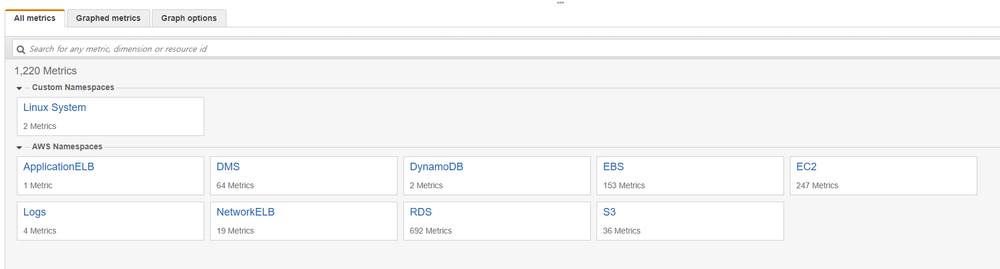

# EC2 Custom Matric 설정
AWS CloudWatch는 AWS에서 접근이 가능한 System에 대한 모니터링을 제공한다. 즉, EC2를 모니터링 할 때에는 AWS에서 관리하지 않는 OS영역의 모니터링은 지원되지 않는다. 예를 들면, Memory 사용량이나 Disk 사용량이 대표적이다. Hypervisor는 Memory와 Disk의 사용량을 그대로 VM에게 이관하기 때문에 모니터링을 전혀 할 수 없다.

그렇다고 CloudWatch에서 Memory에 대한 모니터링이 불가능한 것은 아니다. EC2에서 동작하는 OS에서 CloudWatch Metrics로 값을 전달하게 되면, 그 값을 CloudWatch에서 확인할 수 있게 된다. 이렇게 사용자가 생성한 Metrics를 Cloudwatch Custom Metrics라고 한다.

Custom Metrics는 계정당 10개까지 무료이지만, 종류가 아닌 개수별로 과금이 된다. 예를 들어 Memory 사용량을 모니터링 하는 EC2 Instance가 10대 라면, Custom Metrics를 10개 사용하는 것과 같다. 즉, Custom Metrics 설정이 많으면 많을 수록 EC2를 복제할 시 설정된 Custom Metrics의 개수 만큼 늘어난다.

여기서는 Custom Metrics를 이용하여 EC2의 Memory 사용량을 설정하는 방법에 대해 알아 본다. EC2에 명령을 내리는 방법은 여러가지가 있는데 그 중 System Manager를 이용하여 원격으로 Script를 실행하는 방법이 있다. 이 방법은 EC2에 SSM Agent를 설치한 후 SSM 접근 권한을 가지고 System Manager로 EC2들을 중앙 관리하는데 사용한다.

> [!메모]
>
> 2017년 9월 이후에 발표된 Amazon Linux는 기본적으로 SSM Agent가 설치되어 있다. Windows도 마찬가지로 2016년 11월 이후에 발표된 이미지는 SSM Agent가 설치되어 있으며, 그 이외의 OS의 경우 [SSM Agent 설치 및 구성](https://docs.aws.amazon.com/ko_kr/systems-manager/latest/userguide/ssm-agent.html)을 확인하여 SSM Agnet를 설치해 주어야 한다.

## SSM Role 생성
1. [AWS Web Console](https://signin.aws.amazon.com/console)에 로그인한다.

2. 왼쪽 상단에 **Services**를 클릭하여 **Security, Identity & Compliance**영역에서 **IAM**을 찾아 클릭한다.

3. 왼쪽 네비게이터에서 **Roles**를 클릭한다.

4. **Create role**버튼을 클릭한다.

5. **Create role**화면이 뜨면 **Choose the service that will use this role**영역에서 **EC2**를 클릭한 후 하단에 **Next: Permissions**버튼을 클릭한다.

6. **Attach permissions policies**화면의 검색창에 `AmazonSSMFullAccess`로 검색하여 선택한 후 **Next: Review**버튼을 클릭한다.

7. **Review**화면에서 아래와 같이 입력한 후 **Create role**버튼을 클릭한다.
    - `Role name`: Role 이름을 입력한다. 여기서는 **ssm-ec2role** 이라고 입력한다.
    - `Role description`: Role의 설명을 입력한다.
    - `Trusted entities`: Role의 신뢰설정을 입력한다. 기본 값으로 둔다.
    - `Policies`: Role에 연결된 Policy를 확인한다.

8. Role이 생성되면, 검색창에서 생성된 `ssm-ec2role`을 검색하여 클릭한다.

9. `ssm-ec2role`의 summery가 나오면 **Permissions**탭 오른쪽 하단에 있는 **Add inline policy**를 클릭한다.

10. **Create policy**화면이 뜨면 **JSON**탭으로 이동하여 다음과 같은 내용을 입력한 후 하단에 **Review policy**를 클릭한다.
    ```IAM policy
    {
        "Version": "2012-10-17",
        "Statement": [
            {
                "Sid": "Stmt1525150646025",
                "Action": [
                    "cloudwatch:PutMetricData",
                    "cloudwatch:GetMetricStatistics",
                    "cloudwatch:ListMetrics",
                    "ec2:DescribeTags"
                ],
                "Effect": "Allow",
                "Resource": "*"
            }
        ]
    }
    ```

11. **Review policy**화면에서 정책을 확인 후 다음과 같이 입력한 후 **Create policy**버튼을 클릭한다.
    - `Name`: Policy의 이름을 입력한다. 여기서는 **ec2-custommetrics**로 입력한다.
    - `Summery`: 생성한 정책의 내용을 확인한다.

## EC2에 SSM Role 연결
12. 왼쪽 상단에 **Services**를 클릭하여 **Compute**영역에서 **EC2**를 찾아 클릭한다.

13. 왼쪽 네비게이터에서 **Instances**를 클릭한다.

14. 이전에 만든 **Wordpress**를 선택한 후 마우스 우클릭 또는 상단에 **Actions**를 클릭하여 **Instance Settings**의 **Attach/Replace IAM Role**을 클릭한다.

15. **Attach/Replace IAM Role**화면이 뜨면 **IAM role**항목에서 앞서 생성한 **ssm-ec2role**을 선택한 후 **Apply**버튼을 클릭한다.

16. **IAM role operation succeeded**가 뜨면 **Close**버튼을 클릭한다.

## System Manager를 이용하여 EC2 Instance에 Custom Metrics 설정
17. 왼쪽 상단에 **Services**를 클릭하여 **Management Tools**영역에서 **Syetem Manager**를 찾아 클릭한다.

18. 왼쪽 네비게이터에서 **Run Command**를 클릭한다.

19. 오른쪽에 위치한 **Run a Command**를 클릭하여 Rum Command를 생성한다.

20. **Run a command**화면이 뜨면 다음과 같이 입력한 후 **Run**버튼을 클릭한다.
    - `Command document`: SSM Agnet를 이용하여 실행할 Script 유형을 선택한다. 여기서는 **AWS-RunShellScript**를 검색하여 선택한다.
    - `Targets`: Run a command가 실행 될 EC2 Instance를 선택한다. **Manually selecting instances**를 선택한 후 **Target Instances**에서 **wordpress** Instance를 선택한다.
    - `Command parameters`: **Commands**부분에 다음과 같이 입력한다.
        ```script
        yum install -y perl-Switch perl-DateTime perl-Sys-Syslog perl-LWP-Protocol-https &&
        curl https://aws-cloudwatch.s3.amazonaws.com/downloads/CloudWatchMonitoringScripts-1.2.2.zip -O &&
        unzip CloudWatchMonitoringScripts-1.2.2.zip &&
        rm CloudWatchMonitoringScripts-1.2.2.zip &&
        echo -e "*/5 * * * * /root/aws-scripts-mon/mon-put-instance-data.pl --mem-used-incl-cache-buff --mem-util --disk-space-util --disk-path=/ --from-cron" | crontab
        ```
    - `Working Directory`: Script가 실행 될 폴더를 설정한다. 여기서는 `/root`로 입력한다.
    - `Comment`: Run Script에는 이름을 입력하는 값이 없어 어떤 항목이 어떤 스크립트를 실행했는지 잘 모를 수 있다. 그럴 땐 이 부분에 간단한 설명을 쓰도록 하자. 여기서는 **create custom metrics** 라고 입력한다.
    - `Timeout (seconds)`: Script가 실행되는 시간을 설정한다. 여기서는 **600**을 그대로 둔다
    - `Rate control`: 성공과 실패 확률을 설정하여 조절할 수 있게 한다. 여기서는 기본 값을 쓴다.
    - `Output options`: Script가 실행된 후 결과 값을 S3로 출력하는 옵션이다. 여기서는 기본 값을 쓴다.
    - `SNS notifications`: Script 실행 결과를 SNS로 보내는 옵션이다. 여기서는 기본 값을 쓴다.
    - `AWS command line interface command`: 위에서 설정한 내용을 AWS CLI로 실행할 수 있도록 예제로 출력해 준다.

21. 실행이 완료될 때 까지 기다린 후 **Commant**에 적절한 내용이 있는 항목을 선택한 후 Script 실행 여부를 살펴본다.

22. 왼쪽 상단에 **Services**를 클릭하여 **Management Tools**영역에서 **CloudWatch**를 찾아 클릭한다.

23. 왼쪽 네비게이터에서 **Metrics**를 클릭하면, 다음과 같이 Custom Namespace 영역에 **Linux System**이 있으면 올바르게 설정한 것이다.

    > [!메모]
    >
    > 우리는 5분 주기로 데이터를 넘기도록 설정하였기 때문에, 최소 5분 이상 기다려야 해당 탭이 나온다.