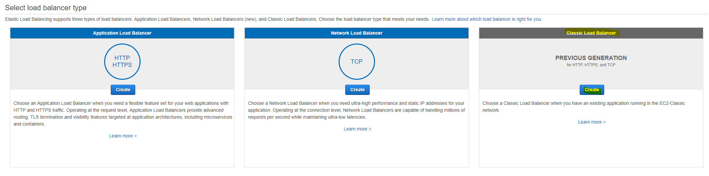
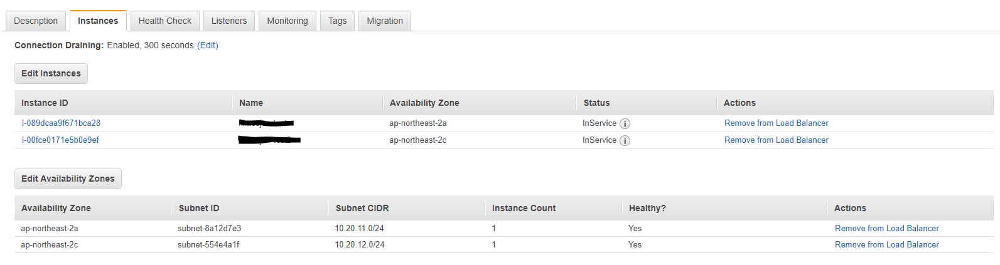

# EC2 이중화 및 ELB 설정
AWS EC2의 SLA 기준에는 Multi-AZ 이중화 구성 시 월 99.95%를 보장한다. 따라서 이중화가 되어있지 않다면, AWS EC2는 SLA를 보장받지 못한다는 이야기가 된다. 그렇기 때문에, 항상 EC2를 디자인 할 때에는 이중화 이상을 고려해야 하며, AWS에서 보상을 받을 생각은 접어두고 아키텍처를 구성하는 것이 좋다.

EC2가 이중화 되어있다면, 트래픽도 그에 상응하게 배분이 되어야 한다. DNS를 조작하여 Active-Standby를 구성할 수도 있지만, 컴퓨팅 자원이 가장 비싼 Cloud 환경에서는 되도록 Active-Active 환경으로 아키텍처를 구성하는 것이 여러모로 이득이 많다.

여기서는 ELB 중 CLB(Classic Load Balancer)를 이용하여 Wordpress를 이중화 하는 방법에 대해 알아보자.

## Custom AMI를 이용하여 EC2 추가 생성 
1. [AWS Web Console](https://signin.aws.amazon.com/console)에 로그인한다.

2. 왼쪽 상단에 **Services**를 클릭하여 **Compute**영역에서 **EC2**를 찾아 클릭한다.

3. 왼쪽 네비게이터에서 **Instances**를 클릭하고, 상단에 **Launch Instance**를 클릭하여 EC2 Instance를 생성한다.

4. **Step 1: Choose an Amazon Machine Image (AMI)** 화면이 뜨면 왼쪽 네비게이터에서 **My AMIs**를 클릭한 후 앞서 생성한 **wordpress-ami** 항목의 **Select**를 클릭한다.

5. **Step 2: Choose an Instance Type**화면이 뜨면 Type이 t2.micro로 되어있는 항목을 선택한 후 하단에 **Next: Configure Instance Details**버튼을 클릭한다.

6. **Step 3: Configure Instance Details**화면이 뜨면 아래와 같이 내용을 입력한 후 **Next: Add Storage**버튼을 클릭한다.
    - `Number of instances`: 생성할 Instance 개수를 선택한다. 기본 값인 1을 사용한다.
    - `Purchasing option`: Spot Instance를 사용할지 선택하는 옵션이다. Spot Instance는 무료가 아니니 체크박스에 체크를 하지 않는다.
    - `Network`: EC2를 생성할 VPC를 선택한다. 이전에 생성한 VPC를 선택한다.
    - `Subnet`: EC2를 생성할 Subnet을 선택한다. 여기서는 **<VPC이름>-Public-EC2-2c**를 선택한다.
    - `Auto-assign Public IP`: 자동으로 공인 IP를 연결할 것인지 선택한다. 이 옵션을 Enable로 선택하면, EC2에 동적 공인 IP가 설정된다. 여기서는 **Enable**을 선택한다.
    - `IAM role`: EC2에 연결할 IAM Role을 선택한다. 나중에 수정이 가능하니 **None**을 선택한다.
    - `Shutdown behavior`: EC2의 OS에서 Instance를 중지할 시 처리하는 옵션을 선택한다. 기본 값인 **Stop**을 선택한다.
    - `Enable termination protection`: EC2를 종료(삭제)하지 못하도록 보호하는 옵션이다. 여기서는 체크박스에 체크를 하지 않는다.
    - `Monitoring`: EC2의 모니터링을 초단위까지 할 수 있는 옵션이다. 과금이니 여기서는 체크박스에 체크를 하지 않는다.
    - `Tenancy`: EC2를 어디에 생성할지를 선택한다. Dedicated EC2나 Dedicated Host를 이용할 시 사용하는 옵션이며, 여기서는 기본 값인 **Shared**를 선택한다.
    - `T2 Unlimited`: T2 type은 CPU Credit을 저장하여 Busting할 수 있다. 이 크래딧을 전부 소모를 하면 성능 저하가 일어나는데, 이 옵션을 켜면 성능 저하를 돈으로 떼울 수 있다. 여기에선 체크박스에 체크를 하지 않는다.
    - `Network interfaces`: 네트워크 인터페이스 설정이다. 기본 값을 그대로 놔둔다.
    - `Advanced Details`: 여기서는 기본 값을 그대로 둔다.

7. **Step 4: Add Storage**화면이 뜨면 모든 값을 기본 값으로 두고 **Next: Add Tags**버튼을 클릭한다.

8. **Step 5: Add Tags**화면이 뜨면 가운데 **Add Tag**버튼을 클릭한 후 다음과 같이 입력하고 **Next: Configure Security Group**버튼을 클릭한다.
    - `Key`: Tag Key를 입력한다. 여기서는 **Name**으로 입력한다.
    - `Value`: Tag Value를 입력한다. 여기서는 **Wordpress-2c**로 입력한다.
    - `Instances`: Instance에 Tag를 설정할 것인지 선택한다. 기본 값으로 둔다.
    - `Volumes`: 같이 생성 될 EBS(volume Disk)에 Tag를 설정할 것인지 선택한다. 기본 값으로 둔다.

9. **Step 6: Configure Security Group**화면이 뜨면 다음과 같이 입력한 후 **Review and Launch**버튼을 클릭한다.
    - `Assign a security group`: Security Group을 만들지, 만들어진 것을 선택할 지를 선택한다. 여기서는 **Select an existing security group**을 선택한다.
    - `Select security groups`: 앞서 생성한 **wordpress-sg**를 찾아 체크박스에 체크를 한다.

10. **Step 7: Review Instance Launch**화면에서 최종적으로 설정을 확인한 다음 하단에 **Launch**버튼을 클릭한다.

11. **Launch**버튼을 클릭하면 **Select an existing key pair or create a new key pair**창이 뜬다. 이번엔 **Choose an existing key pair**를 선택한 후 **Select a key pair**에서 앞서 생성한 Key pair를 선택한 후 하단에 **Launch Instances**버튼을 클릭한다.

12. EC2 Instance Launch가 끝나면, 생성된 EC2 Instance를 선택한 후 하단에 **Description**에 있는 **Public DNS (IPv4)** 또는 **IPv4 Public IP**항목에 있는 값을 복사한 후 새로운 웹 브라우저에 붙여 넣어 정상적으로 Wordpress가 뜨는지 확인한다.

## ELB 생성
13. EC2 Web Console의 왼쪽 네비게이터에서 **Load Balancers**를 클릭한다.

14. 상단에 **Create Load Balancer**버튼을 클릭한다.

15. **Select load balancer type**화면이 뜨면 가장 오른쪽에 회색으로 된 **Classic Load Balancer**에 있는 **Create**버튼을 클릭한다.

16. **Step 1: Define Load Balancer**화면이 뜨면 다음과 같이 입력한 후 오른쪽 하단에 **Next: Assign Security Groups**버튼을 클릭한다.
    - `Load Balancer name`: CLB의 이름을 입력한다. 여기서는 **wordpress-lb** 라고 입력한다.
    - `Create LB Inside`: CLB를 생성할 VPC를 선택한다. 이전에 생성한 VPC를 선택한다.
    - `Create an internal load balancer`: CLB를 Internal로 생성하는 옵션이다. 여기서는 외부에서 접근할 ELB를 생성하기 때문에 체크박스에 체크를 하지 않는다.
    - `Enable advanced VPC configuration:`: 수정할 수 없으니 놔둔다.
    - `Listener Configuration`: CLB에 연결할 Front Port와 Backend Port를 설정한다. 기본 값으로 그대로 둔다.
    - `Select Subnets`: ELB가 생성 될 Subnet을 선택한다. 여기서는 **<VPC이름>-Public-ELB-2a**와 **<VPC이름>-Public-ELB-2c**를 추가한다.

17. **Step 2: Assign Security Groups**화면에서는 다음과 같이 입력한 후 **Next: Configure Security Settings**버튼을 클릭한다.
    - `Assign a security group`: Security Group을 만들지, 만들어진 것을 선택할 지를 선택한다. 여기서는 **Create a new security group**을 선택한다.
    - `Security group name`: Security Group 이름을 입력한다. 여기서는 **wordpress-lb-sg**라고 입력한다.
    - `Description`: Security Group의 설명을 입력한다. `Security group name`과 동일하게 입력한다.
    - `Rule`: 두 개의 Rule을 설정 할 것이다 **Add Rule**버튼을 클릭하여 다음과 같이 두 가지 내용을 입력한다.
        - `Type`: 미리 정의된 Rule의 유형을 선택한다. 여기서는 **HTTP**를 선택한다.
        - `Protocol`: Security Group의 Protocol을 선택한다. `Type`을 **HTTP**로 선택하면 자동으로 입력된다.
        - `Port Range`: Security Group의 Port 범위를 선택한다. `Type`을 **HTTP**로 선택하면 자동으로 입력된다.
        - `source`: EC2에 접근할 수 있는 IP CIDR값을 입력한다. 보안을 위해 **custom**을 클릭하여 드롭 다운메뉴를 펼친 다음 **Anyware**를 선택한다.

18. **Step 3: Configure Security Settings**화면은 선택할 내용이 없다. **Next: Configure Health Check**버튼을 클릭한다.

19. **Step 4: Configure Health Check**화면이 나오면 다음과 같이 입력한 후 **Next: EC2 Instances**버튼을 클릭한다.
    - `Ping Protocol`: Backend에 연결된 EC2 Instance의 상태를 확인할 때 사용할 Protocol을 입력한다. 여기서는 **HTTP**로 선택한다.
    - `Ping Port`: Backend에 연결된 EC2 Instance의 상태를 확인할 때 사용할 Port를 입력한다. 여기서는 **80**을 입력한다.
    - `Ping Path`: Backend에 연결된 EC2 Instance의 상태를 확인할 때 사용할 Path를 입력한다. 여기서는 **/**을 입력한다.
    - `Response Timeout`: Backend에 연결된 EC2 Instance의 상태를 확인할 때 응답을 기다리는 시간을 입력한다. 기본 값인 **5**를 그대로 둔다
    - `Interval`: Backend에 연결된 EC2 Instance의 상태를 확인할 때 확인 주기간 대기 시간을 입력한다. 기본 값인 **30**을 그대로 둔다
    - `Unhealthy threshold`: Backend에 연결된 EC2 Instance가 비정상인지 확인하는 횟수를 입력한다. 기본 값인 **2**를 그대로 둔다
    - `Healthy threshold`: Backend에 연결된 EC2 Instance가 정상인지 확인하는 횟수를 입력한다. 기본 값인 **10**을 그대로 둔다

20. **Step 5: Add EC2 Instances**화면이 뜨면 나머지는 기본 값으로 놔둔 후 이전에 생성한 두 개의 EC2 Instances(**Wordpress**, **Wordpress-2c**)를 선택한 후 **Next: Add Tags**버튼을 클릭한다.

21. **Step 6: Add Tags**화면은 다음과 같이 입력한 후 **Review and Create**버튼을 클릭한다.
    - `Name`: Tag의 이름을 입력한다. 여기서는 **Name**을 입력한다.
    - `Value`: Tag의 값을 입력한다. 여기서는 **wordpress-lb**를 입력한다.

22. **Step 7: Review**화면이 뜨면 앞서 설정한 모든 값들을 확인한 후 **Create**버튼을 클릭한다.

24. **Load Balancer Creation Status**화면에서 **Successfully created load balancer**메세지를 확인하면, **Close**버튼을 클릭하여 완료한다.

25. 생성된 CLB를 선택한 후 하단에 **Instances**탭으로 이동하여 다음 화면과 같이 **State**가 `InService`가 뜨는지 새로고침을 해가며 확인한다.

26. 모든 EC2 Isntance의 **Status**가 `InService`가 떳다면, **Description**탭에서 **DNS Name**을 복사하여 새로운 웹 브라우저 주소창에 붙여 넣은 후 정상적으로 wordpress가 뜨는지 확인한다.

## ELB AccessLog 설정
27. ELB Web Console에서 생성된 CLB를 클릭한 후 **Description**탭의 아랫쪽에 **Attributes**영역에 있는 **Access logs**에 있는 **Configure Access Logs**버튼을 클릭한다.

28. **Configure Access Logs**화면이 뜨면 다음과 같이 입력한 후 **Save**버튼을 클릭한다.
    - `Enable access logs`: CLB의 Access Log를 활성화 하는 옵션이다. 체크박스에 체크를 한다.
    - `Interval`: ELB Log를 쌓는 주기를 설정한다. 여기서는 **60 minutes**를 그대로 둔다.
    - `S3 location`: ELB Log를 쌓을 S3 Bucket을 선택한다. 여기서는 **<ID>.elb.log**라고 입력한다.
    - `Create this location for me`: S3 Bucket 또는 Location이 없을 시 생성하는 옵션이다. 여기서는 새롭게 S3 Bucket을 만드는 옵션이니 체크박스에 체크를 한다.
    > [!메모]
    >
    > Cloudtrail과 마찬가지로 ELB Access Log는 계속 쌓이기만 한다. 따라서 운영하는 ELB의 경우, 주기적으로 이전 Log가 삭제되도록 S3 Bucket에 Lifecycle을 설정하는 것이 좋다.