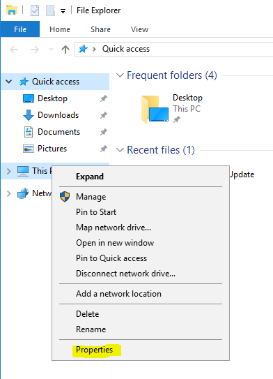
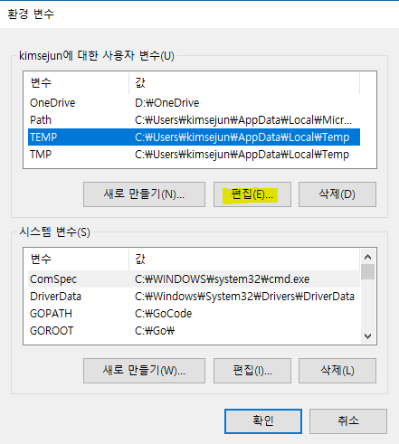

# AWS CLI 설치
AWS CLI는 Python을 기반으로 한 Script이다. AWS를 운영하는데 있어 Web Console이 직관적이고 편하지만, 반복적인 작업이나 Linux환경의 운영자라면 AWS CLI도 사용해봄직 하다. 따라서 이번 실습은 전부 AWS CLI로 진행할 예정이며, 그에 대한 설정 방법에 대해 알아보자

## Windows에서 AWS CLI 설치
1. Python 홈페이지에서 [Python 3.6.5](https://www.python.org/ftp/python/3.6.5/python-3.6.5.exe)를 다운로드 한다.

2. 다운로드 받은 **python-3.6.5.exe**파일을 실행하고 **Install Now**버튼을 클릭하여 Pyhton 3.6.5를 설치한다.

3. python 3.6.5 설치가 완료되면 설치 화면을 닫고, 파일 탐색기를 연다.

4. 파일 탐색기가 열리면 **내 컴퓨터**에서 마우스 오른쪽 버튼을 누른 후 **속성**을 클릭한다.


5. **시스템**창이 뜨면 왼쪽 메뉴에 **고급 시스템 설정**을 클릭한다.

6. **시스템 속성**창이 뜨면 아래쪽에 **환경 변수**버튼을 클릭한다.

7. **환경 변수**창이 뜨면 **<사용자ID>에 대한 사용자 변수**영역에서 **Path**를 선택한 후 **편집**버튼을 클릭한다.


8. 값에 다음과 같이 두개의 항목을 추가한 후 **확인**버튼을 클릭한다.
    ```environment variables
    %USERPROFILE%\AppData\Local\Programs\Python\Python36-32
    %USERPROFILE%\AppData\Local\Programs\Python\Python36-32\Scripts
    ```
    > [!메모]
    >
    > 값을 여러개 입력할 땐 ';'로 구분한다. ';'를 쓸땐 띄어쓰기가 없도록 주의하여야 한다.

9. 떠있는 모든 창을 **확인**버튼을 눌러 닫은 후 시작에서 실행을 클릭하여 `cmd`를 실행한다.

10. 다음 명령어를 사용하여 AWS CLI를 설치한다.
    ```cmd
    > pip install awscli
    ```

11. 다음 명령어를 사용하여 AWS CLI가 정상적으로 설치되었는지 확인한다.
    ```aws-cli
    > aws
    ```

12. AWS CLI를 초기화하는 작업을 해야 한다. 이전에 다운로드 받은 `accessKeys.csv`파일을 연다.

13. 다음 명령어를 사용하여 AWS CLI를 설정한다.
    ```aws-cli
    > aws configure
    
    AWS Access Key ID [None]: accessKeys.csv 파일의 Access Key ID
    AWS Secret Access Key [None]: accessKeys.csv 파일의 Secret access key
    Default region name [None]: ap-northeast-2
    Default output format [None]:
    ```

14. 다음 명령어를 사용하여 정상적으로 S3 Bucket을 불러오는지 확인한다.
    ```aws-cli
    > aws s3 ls
    ```