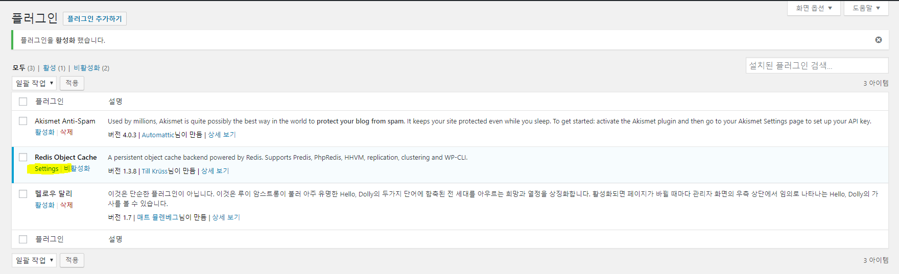

# ElastiCache와 Wordpress 연동
ElastiCache는 AWS에서 사용할 수 있는 관리형 Cache 서비스이다. Open Source인 Memcached와 Redis를 지원하고 있으며, 기존 기능들을 그대로 사용할 수 있다는 점이 특이하다. 하지만 관리형 서비스이기 때문에 상세적인 설정은 어렵다.

여기서는 ElastiCache를 Redis로 생성하고, Wordpress의 Plugin을 사용하여 ElastiCache Redis와 연동하는 시나리오를 알아보도록 한다.

## ElastiCache 생성 전 준비
1. [AWS Web Console](https://signin.aws.amazon.com/console)에 로그인한다.

2. 왼쪽 상단에 **Services**를 클릭하여 **Compute**영역에서 **EC2**을 찾아 클릭한다.

3. 왼쪽 네비게이터에서 **Security Groups**를 클릭한다.

4. 왼쪽 상단에 **Create Security Group**버튼을 클릭한다.

5. **Create Subnet Group**창이 뜨면 다음과 같이 입력한 후 **Create**버튼을 클릭한다.
    - `Security group name`: Security Group 이름을 입력한다. 여기서는 **wordpresscache-sg**라고 입력한다.
    - `Description`: Security Group의 설명을 입력한다. 여기서는 **wordpresscache-sg**라고 입력한다.
    - `VPC`: Security Group을 생성할 VPC를 선택한다. 이전에 생성한 VPC를 선택한다.
    - `Inbound`: Inbound 정책을 추가한다. **Add Rule** 버튼을 클리하여 다음 정책을 추가하자.
        - `Type`: 미리 정의된 Rule의 유형을 선택한다. 여기서는 **Custom TCP Rule**를 선택한다.
        - `Protocol`: Security Group의 Protocol을 선택한다. `Type`을 **Custom TCP Rule**로 선택하면 자동으로 입력된다.
        - `Port Range`: Security Group의 Port 범위를 선택한다. 여기서는 **6379**를 입력한다.
        - `source`: EC2에 접근할 수 있는 IP CIDR값을 입력해야 하지만, Security Group ID도 입력할 수 있다. 여기서는 **wordpress-sg**을 입력하여 나타난 Security Group ID를 선택한다.
        - `Description`: Rule의 설명을 입력한다. 여기서는 **wordpresstoredis**라고 입력한다.

6. 왼쪽 상단에 **Services**를 클릭하여 **Database**영역에서 **ElastiCache**을 찾아 클릭한다.

7. 왼쪽 네비게이터에서 **Subnet Groups**를 클릭한다.

8. 상단에 **Create Subnet Group**버튼을 클릭하고 다음과 같이 입력한 후 **Create**버튼을 클릭한다.
    - `Name`: ElastiCache Subnet Group 이름을 입력한다. 여기서는 **wordpress-cache**로 입력한다.
    - `Description`: ElastiCache Subnet Group 설명을 입력한다. 여기서는 **wordpress-cache**로 입력한다.
    - `VPC ID`: 이전에 생성한 VPC ID를 선택한다.
    - `Availability Zone`: ElastiCache Subnet Group을 생성할 Subnet의 AZ를 선택한다. **ap-northeast-2a**를 우선 선택한다.
    - `Subnet ID`: ElastiCache Subnet Group을 생성할 Subnet을 선택한다. 여기서는 **<VPC이름>-Private-RDB-2a**의 Subnet ID를 선택하고 하단에 Add 버튼을 클릭하여 오른쪽에 추가시킨다.
    - `Availability Zone`: 오른쪽에 Subnet이 추가되었다면, 위와 마찬가지 방법으로 **ap-northeast-2c**를 선택한다.
    - `Subnet ID`: **<VPC이름>-Private-RDB-2c**의 Subnet ID를 선택하고 하단에 Add 버튼을 클릭하여 오른쪽에 추가시킨다.

## ElastiCache 생성
9. 왼쪽 네비게이터에서 **Redis**를 클릭한다.

10. 왼쪽 상단에 **Create**버튼을 클릭하고 다음과 같이 입력한 후 하단에 **Create**버튼을 클릭한다.
    - `Cluster engine`: ElastiCache의 Engine을 선택한다. 여기서는 **Redis**를 선택하고 **Cluster Mode enabled**의 체크박스는 체크하지 않는다.
    - `Name`: ElastiCache의 이름을 입력한다. 여기서는 **wordpress-redis**라고 입력한다.
    - `Description`: ElastiCache의 설명을 입력한다. 여기서는 **wordpress-redis**라고 입력한다.
    - `Engine version compatibility`: ElastiCache의 Engine 버전을 선택한다. 여기서는 **3.2.10**을 선택한다.
    - `Port`: ElastiCache의 서비스 포트를 입력한다. 여기서는 **6379**를 입력한다.
    - `Parameter group`: ElastiCahce의 parameter group을 선택한다. 기본 값을 그대로 사용한다.
    - `Node type`: ElastiCache의 Type을 선택한다. 여기서는 **cahce.t2.micro**를 선택한다.
    - `Number of replicas`: ElastiCache의 Node 복제 수를 선택한다. 여기서는 **None**을 선택한다.
    - `Subnet group`: ElastiCache가 생성될 Subnet Group을 선택한다. 여기서는 앞서 생성한 **wordpress-cache**를 선택한다.
    - `Preferred availability zone(s)`: ElastiCache를 생성 핳 AZ를 선택한다. 여기서는 **Select zones**을 선택한 후 **Primary**에서 **ap-northeast-2c**를 선택한다.
    - `Security groups`: ElastiCache에 연결할 Security Group을 선택한다. 여기서는 **wordpresscache-sg**에 체크박스에 체크를 한 후 **Default**의 체크박스 체크를 해제한다.
    - `Encryption at-rest`: 디스크에 저장된 데이터를 암호화 하는 옵션이다. 3.2.6에서만 지원한다.
    - `Encryption in-transit`: 데이터 전송 중 암호화를 하는 옵션이다. 3.2.6에서만 지원한다.
    - `Seed RDB file S3 location`: S3 bucket에 데이터를 백업하는 옵션이다. 여기서는 공란으로 둔다.
    - `Enable automatic backups`: 자동 백업 설정에 대한 옵션이다. cache.t2.micro에서는 지원하지 않는다.
    - `Maintenance window`: 유지보수 시간을 설정한다. 여기서는 **No preference**를 선택한다.
    - `Topic for SNS notification`: SNS를 이용하여 알람을 설정한다. 여기서는 **Disable notifications**를 선택한다.

## Wordpress에 Plugin 설치 및 연동
11. Wordpress 한 대에만 우선적으로 Redis Cache를 적용해야 한다. 생성한 **wp-wordpress01**의 Public IP를 가지고 웹 브라우저로 wordpress에 접근한다.

12. Wordpress를 관리자 권한으로 로그인 한다.

13. 관리자 권한으로 로그인 한 후 왼쪽 네비게이터에서 **플러그인**에 **플러그인 추가하기**를 클릭하고 **redis**로 검색한다.

14. 다음과 같이 **Redis Object Cache**를 **지금 설치하기**버튼을 눌러 설치한다.


15. 설치가 완료되면 **활성화**버튼을 클릭한 후 **Settings**를 클릭한다.


16. **wp-wordpress01** Instance에 putty 또는 bash를 통해 터미널로 접속한다.

17. 다음과 같은 내용을 `/var/www/html/wp-config.php`파일에 추가 한다.
    ```wp-config.php
    ...
    define('WP_REDIS_HOST', '<ElastiCache Redis의 Endpoint>');
    define('WP_REDIS_PORT', '6379');
    ...
    ```

18. 다음 명령어를 실행하여 httpd를 재시작 한다.
    ```bash
    $ sudo service httpd restart
    ```

19. wordpress 관리자 화면으로 돌아와 페이지를 새로고침 한 후 다음 그림과 같이 상단에 **Enable Object Cache**버튼을 클릭한다.


20. **wp-wordpress01**에 설정이 완료되었으니 이제 **wp-wordpress02**도 동일하게 설정해야 한다. 앞서 **wp-wordpress01**과 동일하게 진행해도 되고, AWS Console에 익숙한 분들은 **wp-wordpress01**을 AMI로 생성한 후 **wp-wordpress02**를 재배포 해보자.