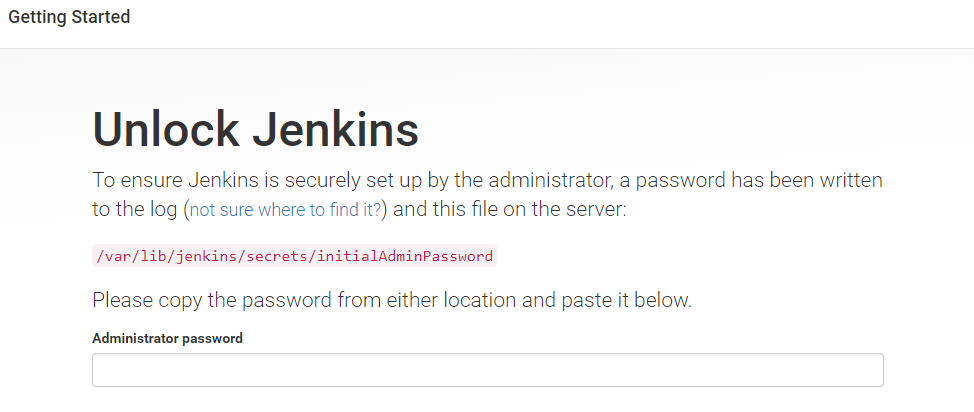

# Jenkins 설치
Jenkins는 CI/CD를 위한 Management Toolkit이다. Opensource 포르젝트이며, 누구나 수정 및 보안이 가능하다. Jenkins로 코드 테스트 및 배포 자동화를 구성하는 많은 업체들이 있으며 수동으로 해야 할 일들을 자동화 해줌으로써 사람이 아닌 시스템으로 코드와 인프라 관리가 가능해 진다.

여기서는 VPC 생성 방법과 EC2 생성 방법에 대해 자세히 다루지 않고, Jenkins 설치하고 EC2 Plugin을 설정하는 것에 대해서만 다룬다.

## EC2에 Jenkins 설치
1. [AWS Web Console](https://signin.aws.amazon.com/console)에 로그인한다.

2. 왼쪽 상단에 **Services**를 클릭하여 **Compute**영역에서 **EC2**를 찾아 클릭한다.

3. 왼쪽 네비게이터에서 **Instances**를 클릭하고, 상단에 **Launch Instance**를 클릭하여 다음 옵션을 참고하여 EC2 Instance를 생성한다.
    - `Instance Type`: t2.micro
    - `AMI`: Amazon Linux
    - `Security Group`: Port 22, 80, 8080 Any open
    - `Security Group Name`: jenkins-sg
    - `Instance Name`: jenkins
    - `Auto-assign Public IP`: Enable
    - `EBS Volume size`: Default

4. 생성된 EC2 Instance에 `putty` 또는 `bash`를 이용하여 접속한다.

5. 다음 명령어를 사용하여 EC2를 최신 버전으로 업데이트 한다.
    ```bash
    $ sudo yum update -y
    ```

6. 현재 jenkins는 JAVA 8 에서 동작한다. 다음 명령어를 사용하여 JAVA 8을 설치한다.
    ```bash
    $ sudo yum install java-1.8.0 -y
    ```

7. 다음 명령어를 사용하여 jenkins repo를 등록한다.
    ```bash
    $ sudo wget -O /etc/yum.repos.d/jenkins.repo http://pkg.jenkins-ci.org/redhat/jenkins.repo
    ```

8. 다음 명령어를 사용하여 Jenkins-CI에서 key파일을 가져온다.
    ```bash
    $ sudo rpm --import https://pkg.jenkins.io/redhat/jenkins.io.key
    ```
 
9. 다음 명령어를 사용하여 jenkins를 설치한다.
    ```bash
    $ sudo yum install jenkins -y
    ```

10. 다음 명령어를 사용하여 jenkins를 실행한다.
    ```bash
    $ sudo service jenkins start
    ```

11. jenkins Instance의 Public IP 또는 Public DNS를 복사하여 새로운 웹 브라우저에 `http://<Instance Public IP or Public DNS>:8080`형식으로 접속한다.

12. 다음과 같은 화면이 뜨면 텍스트 박스에 jenkins Administrator Password를 입력한 후 **Continue**버튼을 클릭한다. jenkins Administrator Password는 다음 명령어를 사용하여 확인한다. 
    ```bash
    $ sudo cat /var/lib/jenkins/secrets/initialAdminPassword
    ```
    

13. **Customize Jenkins**화면이 뜨면 **Install suggested plugins**를 클릭한다.

14. 설치가 완료되면 **Create First Admin User**화면이 뜨면 계정과 암호, 이름, 이메일 주소를 입력한 후 **Save and Continue**버튼을 클릭한다.

15. **Instance Configuration**화면에서 jenkins 접속 URL을 확인한 후 **Save and Finish**버튼을 클릭하여 jenkins 설정을 완료한다.

16. jenkins 화면이 뜨면 왼쪽 네비게이터에서 **Jenkins 관리**를 클릭하고 **플러그인 관리**를 클릭한다.

17. **설치 가능**탭에서 오른쪽 상단에 **필터**검색란에 `Amazon EC2`를 입력한다. 검색된 `Amazon EC2`를 선택한 후 **재시작 없이 설치하기**버튼을 클릭한다.

18. 설치가 완료되면 **메인 페이지로 돌아가기**를 클릭한다.

19. 왼쪽 네비게이터에서 **Jenkins 관리**를 클릭하고 **시스템 설정**을 클릭한다.

20. 제일 아래쪽에 **Cloud**섹션이 있는 곳 까지 스크롤을 내린 후 **Add a new cloud**버튼을 클릭하여 **Amazon EC2**를 선택한다.

21. 내용들을 전부 입력한 후 아랫쪽에 **저장**버튼을 클릭한다. 설정 중 **Amazon EC2 Credentials**는 꼭 입력해야 하며, **Add**버튼을 클릭하여 Kind 필드에 **AWS Cerdentials**를 선택하여 입력하자.

22. 이제 jenkins build slave시 EC2 Instance를 사용할 수 있다.